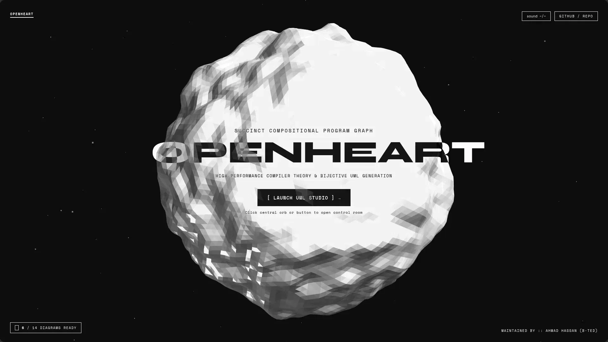
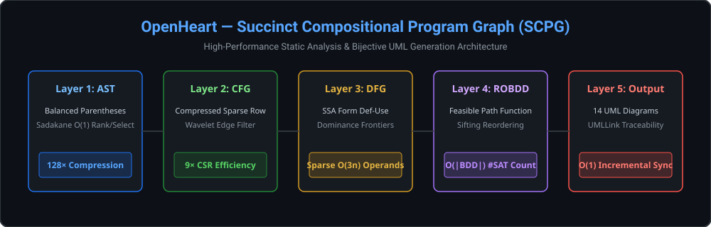

<div align="center">

# OpenHeart

<p align="center">
  
</p>

### Succinct Compositional Program Graph (SCPG) Engine & Universal UML 2.5 Studio

[](https://www.rust-lang.org/)
[](LICENSE)
[](https://ahmadhassan-bted.github.io/OpenHeart/)
[](https://github.com/AhmadHassan-BTed/OpenHeart/actions)
[](SECURITY.md)
[-blueviolet.svg?style=flat-square)](https://github.com/AhmadHassan-BTed)

<br/>

<p align="center">
  
</p>

<p align="center">
  A high-performance static program analysis compiler and bidirectional UML 2.5 projection platform built on succinct bitstring trees, memory-mapped binary layouts, and formal graph semantics.
</p>

</div>

---

## 🌟 System Overview & Human Intent

Software codebases are living artifacts of human intellect designed to express domain logic, structural design, and operational intent. Traditional static analysis frameworks—such as pointer-heavy Code Property Graphs or lowered compiler IRs—strip away this high-level context, introducing massive memory inflation and pointer-chasing latency that isolate static analysis from real-time developer workflows.

Designed, created, and maintained solely by **Ahmad Hassan (B-Ted)**, **OpenHeart** introduces the **Succinct Compositional Program Graph (SCPG)**—a formal 7-tuple graph representation:

$$\mathcal{G} = (V, E, \nu, \varepsilon, \tau, \rho, \Sigma_\Phi)$$

By combining Succinct Balanced Parentheses (BP) trees, Compressed Sparse Row (CSR) control flow graphs, Static Single-Assignment (SSA) data flow representations, and Reduced Ordered Binary Decision Diagram (ROBDD) path summaries, OpenHeart achieves up to **128× memory compression** while maintaining **$O(1)$ bidirectional source-to-diagram traceability**.

---

## 🚀 Key Technical Features

- **128× Memory Compression**: Replaces pointer-heavy AST nodes with Succinct Balanced Parentheses (BP) bitstrings and $O(1)$ Jacobson Rank/Select indexes.
- **$O(1)$ Universal Traceability**: Monotonic 32-bit `token_id` anchors link raw source positions directly to IR graph nodes and derived UML elements.
- **19 Universal Diagram Projections**: Generates all 14 standard OMG UML 2.5 diagrams + 5 deep compiler pipeline IRs directly from binary graph layers.
- **Zero-Backend In-Browser GitHub Ingestion**: 100% free-forever client-side cloning and AST parsing running directly on GitHub Pages.
- **Declarative Manifest Architecture**: Centralized `manifest.json` controlling categories, diagrams, 16 relationship terminologies, and 24 classifier node schemas with zero hardcoding.
- **Zero-Copy Memory Mapping**: All 10 compilation pipeline phases serialize into CRC-64 verified binary artifacts mapped directly into OS page memory.
- **Multi-Repo Convergence**: Validated with $F_1 = 1.0000$ precision across Java, Kotlin, Python, Rust, TypeScript, and C++ codebases.

---

## 📊 Complete 19-Diagram Suite Specification

OpenHeart deterministically derives 19 specialized graph projections organized into 3 distinct categories:

### 1. UML 2.5 Structural Projections (7 Diagrams)
1. **01 · Class Diagram** (`package_tree` engine): Complete class taxonomy, inheritance hierarchies, interfaces, fields, methods, and member visibility.
2. **02 · Package Diagram** (`hierarchical` engine): Multi-tier domain namespaces, package containment hierarchy, and inter-package dependencies.
3. **03 · Component Diagram** (`hierarchical` engine): Modular subsystems, provided/required interfaces, and runtime service wiring.
4. **04 · Composite Structure Diagram** (`hierarchical` engine): Internal parts, ports, and assembly connectors within composite classifiers.
5. **05 · Object Diagram** (`hierarchical` engine): Runtime heap instances, object identities, and reference linkages.
6. **06 · Deployment Diagram** (`hierarchical` engine): Execution environment nodes, devices, and artifact distribution topologies.
7. **07 · Profile Diagram** (`hierarchical` engine): Metamodels, stereotypes, tagged values, and `<<extend>>` arrows.

### 2. UML 2.5 Behavioral Projections (7 Diagrams)
8. **08 · Sequence Diagram** (`sequence` engine): Lifeline message traces, synchronous/asynchronous dispatches, and activation bars.
9. **09 · State Machine Diagram** (`hierarchical` engine): Finite states, initial/final pseudostates, transition triggers, and entry/do/exit activities.
10. **10 · Activity Diagram** (`hierarchical` engine): Business logic workflows, control nodes, decision branches, and swimlanes.
11. **11 · Use Case Diagram** (`usecase` engine): Actor boundaries, goal-driven use cases, `<<include>>`, and `<<extend>>` dependencies.
12. **12 · Communication Diagram** (`hierarchical` engine): Object collaboration topology with sequenced message ordering numbers.
13. **13 · Interaction Overview Diagram** (`hierarchical` engine): High-level control flow between nested sequence reference frames (`ref sd`).
14. **14 · Timing Diagram** (`timing` engine): Multi-track temporal waveforms, clock events, and state change transitions over time.

### 3. Compiler Pipeline IRs (5 Diagrams)
15. **15 · Control Flow Graph (CFG)** (`hierarchical` engine): Basic block partitioning, branching conditions, and loop back-edges.
16. **16 · Data Flow Graph (DFG)** (`hierarchical` engine): SSA def-use value lineage chains and operand dependencies.
17. **17 · Control Dependence Graph (CDG)** (`hierarchical` engine): Reversed post-dominator control conditions governing basic block execution.
18. **18 · Call Graph (CG)** (`hierarchical` engine): Interprocedural call sites, CHA virtual method dispatch resolution, and recursion SCCs.
19. **19 · ROBDD Saturation** (`hierarchical` engine): Canonical Reduced Ordered Binary Decision Diagram path summaries and exact #SAT path counting.

---

## ⚡ Master 10-Phase SCPG Compilation Pipeline

```text
Phase 1 (COMPLETED) ──► Phase 2 (COMPLETED) ──► Phase 3 (COMPLETED) ──► Phase 4 (COMPLETED) ──► Phase 5 (COMPLETED)
Lexical Ingestion       BP AST & Succinct      Symbol Table &         CFG CSR & Dominator    SSA Conversion, CDG
& Token Corpus (.tca)   Reduction (.bpa)       Hierarchy (.sta)       Tree (.cfa)            & IFDS Solver (.ssa)

        │
        ▼
Phase 6 (COMPLETED) ──► Phase 7 (COMPLETED) ──► Phase 8 (COMPLETED) ──► Phase 9 (COMPLETED) ──► Phase 10 (COMPLETED)
Inter-procedural        Traceability Index     ROBDD Path             UML Semantic           SCPG Binary (.scpg)
Call Graph (.cga)       Forward/Backward       Summaries (.psa)       Metadata (.uma)        & Query Engine
```

---

## 📦 Binary Artifact Specifications

| Phase | Artifact Extension | Magic Header | Core Storage Strategy & Data Structures |
|---|---|---|---|
| **Phase 1** | `.tca` | `TCA\0` | `SourceFileRecord[]`, 16-byte `TokenRecord[]`, FNV-1a `StringInterner` |
| **Phase 2** | `.bpa` | `BPA\0` | Balanced Parentheses bitstrings (`u64[]`), `JumpTable`, `RankSelectIndex`, `SparseTableRMQ` |
| **Phase 3** | `.sta` | `STA\0` | `SymbolRecord[]`, `ScopeNode[]`, `TypeHierarchyEdge[]`, `StdLibManager` |
| **Phase 4** | `.cfa` | `CFA\0` | `SuccessorCSR`, `PredecessorCSR`, `idom[]`, `DominanceFrontierCSR` |
| **Phase 5** | `.ssa` | `SSA\0` | `SSARecord[]`, `PhiRecord[]`, `DefUseCSR`, `CDGCSR`, IFDS Solvers |
| **Phase 6** | `.cga` | `CGA\0` | `CallSiteRecord[]`, `CallEdgeCSR`, Andersen Points-To Allocation Sets |
| **Phase 7** | `.tra` | `TRA\0` | Forward Map, Backward Map, Bijective `UMLLinkRecord[]` |
| **Phase 8** | `.psa` | `PSA\0` | `FunctionPSAHeader[]`, 12-byte Compact `ROBDDNodeTable` |
| **Phase 9** | `.uma` | `UMA\0` | `ClassRecord[]`, `ObjectRecord[]`, `SequenceDiagramRecord[]`, GoF Pattern Matches |
| **Phase 10** | `.scpg` | `SCPG` | Unified Memory-Mapped SCPG Header, Layer Maps, Cross-Layer Indexes |

---

## 📁 Repository Structure

```text
OpenHeart/
├── src/                          # Native Rust Engine Implementation (10 Compilation Phases)
│   ├── adapters/                 # HTTP REST API Server & Git Clone Ingestion Adapter
│   ├── ast/                      # Phase 2: Balanced Parentheses (BP) AST & Rank/Select LCA Engine
│   ├── cfg/                      # Phase 4: Control Flow Graph (CSR) & Cooper Dominators
│   ├── cg/                       # Phase 6: Call Graph & Andersen Points-To Analysis
│   ├── core/                     # Core Types, Binary Serialization Primitives & Logger
│   ├── ingestion/                # Phase 1: Tree-sitter Lexical Ingestion & Token Corpus (.tca)
│   ├── psa/                      # Phase 8: ROBDD Path Summaries & #SAT Path Counting (.psa)
│   ├── scpg/                     # Phase 10: SCPG Binary Serializer, Query Engine, & Diagram Exporters
│   │   ├── diagram/              # Multi-Format Abstract Factory (JSON, PlantUML, Mermaid, XMI)
│   ├── ssa/                      # Phase 5: SSA Form, CDG, & IFDS Data Flow Solvers (.ssa)
│   ├── symbol/                   # Phase 3: Symbol Table & Scope Graph Engine (.sta)
│   ├── tra/                      # Phase 7: Universal Traceability Index (.tra) & UMLLinks
│   ├── uma/                      # Phase 9: UML Semantic Metadata Artifact (.uma) & Pattern Detectors
│   ├── lib.rs                    # Library Crate Root
│   └── main.rs                   # Engine CLI Entrypoint
│
├── web/                          # OpenHeart Web Studio Portal (100% Free Zero-Backend on GitHub Pages)
│   ├── diagrams/                 # Declarative manifest.json + 19 JSON & PUML Projections
│   ├── js/                       # Modular ES6 Web Engine (Layout, Renderer, Canvas, Editor, File Tree)
│   │   ├── themes/               # Theme Manager & Dynamic Cytoscape Stylesheet Compiler
│   │   ├── uml-card-renderer.js  # Vector SVG Card Generators
│   │   ├── uml-layout.js         # Deterministic Spatial Layout Engines
│   │   ├── puml-parser.js        # Generic PlantUML / Mermaid Parser
│   │   ├── graph-canvas.js       # Interactive Cytoscape Canvas Controller
│   │   ├── editor.js             # Monaco Precision Code Synchronizer
│   │   ├── file-tree.js          # Deterministic File Tree Explorer
│   │   └── github-engine.js      # Zero-Backend In-Browser GitHub Repo Analyzer
│   ├── index.html                # Single-Page Web Studio Application
│   └── style.css                 # Premium Swiss Design System & Dark/Light Themes
│
├── tests/                        # Unit & Integration Test Suite (47 Unit + 22 Integration Tests)
├── docs/                         # Architecture Specifications & Onboarding Guides
├── Cargo.toml / Cargo.lock       # Rust Package Dependencies & Build Configuration
└── Makefile                      # Convenient Targets for Build, Test, & Server Launch
```

---

## 🛠️ Quickstart & Local Execution

### 1. Launch Live Web Studio (No Installation Required)
Access the live studio directly in your browser:
👉 **[OpenHeart Web Studio on GitHub Pages](https://ahmadhassan-bted.github.io/OpenHeart/)**

### 2. Build Engine
```bash
cargo build --release
```

### 3. Run Single Codebase Analysis
```bash
target/release/openheart analyze ./my_project ./output_dir
```

### 4. Launch Web Server & Interactive Web Studio
```bash
target/release/openheart server 8080
```
Then visit `http://localhost:8080` in your web browser.

### 5. Run Integration Test Suite
```bash
cargo test --all-targets
```

---

## 📚 Documentation Index

- **[System Overview](docs/overview.md)**: Formal mathematical definitions, comparative analysis, and succinct data structures.
- **[System Architecture](docs/architecture.md)**: 10-Phase pipeline design and 19 diagram mappings.
- **[Codebase Guide](docs/codebase-guide.md)**: Repository layout, module structure, and internal developer reference.
- **[Getting Started](docs/getting_started.md)**: Workspace setup, Web Studio usage, and command-line execution.
- **[Succinct Structures](docs/succinct_structures.md)**: BP ASTs, CSR CFGs, Wavelet Trees & ROBDD proof specs.
- **[UML Derivation](docs/uml_derivation.md)**: Derivation rules for structural, behavioral, and compiler IR diagrams.
- **[Architectural Roadmap](ROADMAP.md)**: Complete 10-phase SCPG compilation pipeline overview.

---

## 📜 License & Author

Authored, created, and maintained solely by **Ahmad Hassan (B-Ted)** under the [MIT License](LICENSE).
