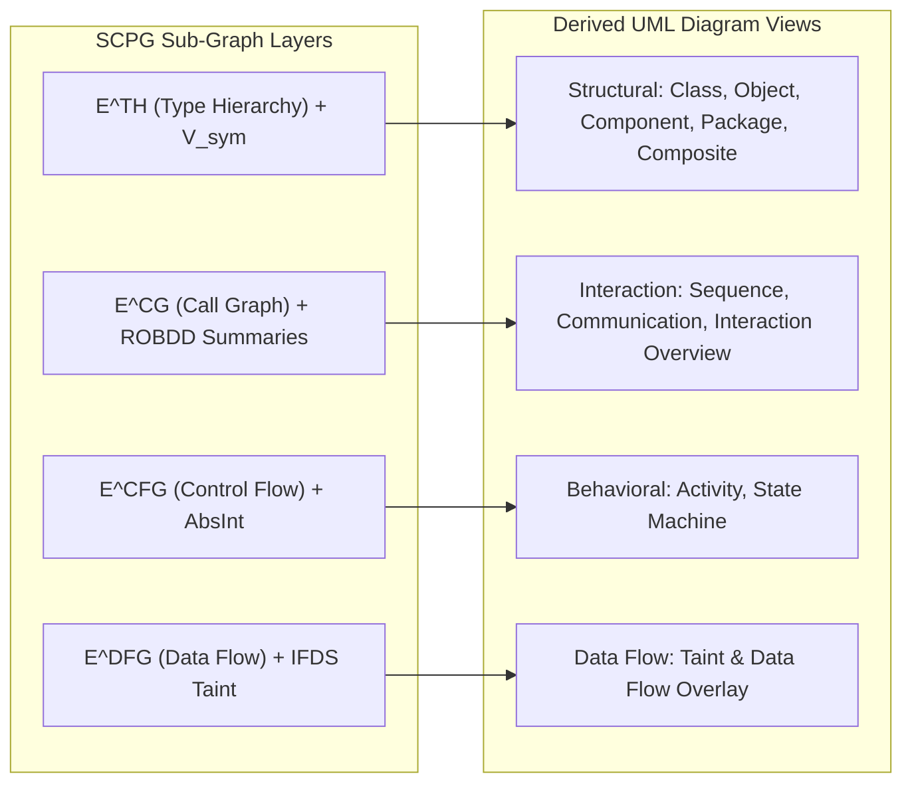

# OpenHeart: Succinct Compositional Program Graph (SCPG) Engine

[](https://www.rust-lang.org/)
[](LICENSE)
[](https://github.com/AhmadHassan-BTed/OpenHeart/actions)
[](SECURITY.md)
[](CODE_OF_CONDUCT.md)

> **OpenHeart** is a next-generation static program analysis engine and bidirectional UML generation platform powered by the **Succinct Compositional Program Graph (SCPG)** architecture.

---

## 🏷️ Tags & Categories

`#compiler-theory` `#succinct-data-structures` `#program-analysis` `#uml-generator` `#rust` `#tree-sitter` `#static-analysis` `#robdd` `#ast` `#cfg` `#dfg` `#code-property-graph`

---

## 💡 About & Core Ideology

Traditional Code Property Graphs (CPGs) rely on pointer-heavy node-centric storage models that suffer from severe memory inflation (allocating 30–40 bytes per node/edge) and pointer-chasing traversal overhead. 

**OpenHeart** replaces legacy graph engines with succinct, cache-line aligned, memory-mapped data structures that achieve up to **128× compression** for syntax trees and $O(1)$ bidirectional source-to-diagram traceability.

### The 7-Tuple SCPG Specification

Formally, an SCPG is defined as a 7-tuple:

$$\mathcal{G} = (V, E, \nu, \varepsilon, \tau, \rho, \Sigma_\Phi)$$

- **Vertex Partition** $V = V_{\text{tok}} \sqcup V_{\text{syn}} \sqcup V_{\text{bb}} \sqcup V_{\text{ssa}} \sqcup V_{\text{sym}}$: Strict subsumption lattice enabling $O(1)$ projection between tokens, AST nodes, basic blocks, SSA definitions, and symbol declarations.
- **Typed Edge Set** $E = E^{\text{AST}} \cup E^{\text{CFG}} \cup E^{\text{DFG}} \cup E^{\text{CDG}} \cup E^{\text{CG}} \cup E^{\text{TH}}$: Unifies structural, control, data flow, call graph, and type hierarchy edges.
- **Source Traceability Anchor** $\tau: V_{\text{tok}} \to \mathbb{N}^4$: Maps every token to a monotonic 32-bit `token_id` propagating upward through all pipeline stages.
- **Symbolic Path Summaries** $\Sigma_\Phi$: Reduced Ordered Binary Decision Diagrams (ROBDDs) encoding feasible path sets per function.

---

## 🏗️ 5-Layer Storage Architecture

| Layer | Storage Technology | Computational Guarantee | Compression vs. Legacy |
|---|---|---|---|
| **Layer 1: AST** | Balanced Parentheses (BP) + Rank/Select | $O(1)$ tree navigation (`parent`, `lca`, `subtree_size`) | **128×** vs pointer trees |
| **Layer 2: CFG** | Compressed Sparse Row (CSR) | $O(\text{outdeg})$ sequential cache-friendly block traversal | **9×** vs property graphs |
| **Layer 3: Edges** | Wavelet Tree | $O(\log \sigma)$ type-filtered edge enumeration | **2×** bit compression |
| **Layer 4: DFG** | SSA Form + Dominance Frontiers | $O(1)$ array lookup for variable definition sites | Sparse $O(3n)$ storage |
| **Layer 5: Paths** | ROBDDs + Sifting Optimizer | $O(|\text{ROBDD}|)$ path counting (#SAT) & feasibility checks | Compact BDD encoding |

---

## 📊 14 Native UML Diagram Derivations

The SCPG provides native, deterministic derivation for all 14 UML diagram types:



---

## 🗺️ 5-Phase Implementation Roadmap

- [x] **Phase 1: Lexical Ingestion & Token Corpus Construction** *(Completed)*
  - Tree-sitter scanner integration, monotonic `token_id` assignment, 64-bit FNV-1a `StringInterner`, `.tca` binary file format serializer with CRC-64 verification, and enforcement of Invariants 1–4.
- [ ] **Phase 2: BP AST Encoding & Scope Graph Semantic Resolution**
  - Balanced Parentheses AST sequence builder, rank/select auxiliary index, and scope graph name binding.
- [ ] **Phase 3: CFG CSR Construction & SSA DFG Encoding**
  - Basic block partitioning, CSR adjacency encoding, Wavelet Tree edge label compression, and Lengauer-Tarjan dominance frontiers.
- [ ] **Phase 4: ROBDD Path Summaries & Symbolic Execution Tier**
  - Shannon expansion, ROBDD construction, sifting dynamic variable reordering, and Z3 SMT solver integration.
- [ ] **Phase 5: Interprocedural Analysis & Dynamic UML Diagram Generator**
  - IFDS framework tabulation, Abstract Interpretation (Interval/Octagon domains), CFL-reachability query engine, and incremental UML visualization synchronization.

See [ROADMAP.md](ROADMAP.md) for full phase details and timeline.

---

## 🛠️ Repository Layout

```text
OpenHeart/
├── .github/
│   ├── workflows/             # GitHub Actions CI & Release pipelines
│   │   ├── ci.yml             # Cargo check, clippy, fmt & test workflow
│   │   └── release.yml        # Release publishing workflow
│   ├── ISSUE_TEMPLATE/        # Standardized issue templates
│   │   ├── bug_report.md
│   │   └── feature_request.md
│   ├── PULL_REQUEST_TEMPLATE.md
│   └── dependabot.yml         # Automated dependency update configuration
├── src/
│   ├── core/
│   │   ├── io/                # Binary Little-Endian reader/writer & mmap wrapper
│   │   └── types/             # TokenRecord (16B), TokenEntry (16B), SourceFileRecord (64B)
│   ├── phase1/
│   │   ├── adapter/           # LanguageAdapter trait & JavaLanguageAdapter
│   │   ├── parser/            # Tree-sitter CST parser integration
│   │   ├── allocator.rs       # Monotonic AtomicU32 TokenIdAllocator
│   │   ├── builder.rs         # Forward/Backward index builder & invariant checks
│   │   ├── interner.rs        # FNV-1a open-addressing StringInterner
│   │   ├── serializer.rs      # Binary .tca format serializer & CRC-64 verification
│   │   └── walker.rs          # Left-to-right DFS CST leaf token walker
│   └── lib.rs                 # Root library exports
├── tests/
│   └── phase1_tests.rs        # Integration and end-to-end pipeline tests
├── docs/
│   ├── overview.md            # Detailed SCPG mathematical specification & formal analysis
│   ├── architecture.md        # 5-Phase pipeline system architecture guide
│   ├── succinct_structures.md # BP ASTs, CSR CFGs, Wavelet Trees & ROBDD proof specs
│   ├── uml_derivation.md      # 14 UML diagram derivation rules & query formulas
│   ├── traceability_and_incremental.md # Universal token_id traceability & diff engine
│   ├── security-architecture.md# Security posture, cryptographic checksums & bounds
│   ├── codebase-guide.md      # Codebase module map & quick reference for contributors
│   ├── technical-decisions.md # Architecture Decision Records (ADR-001 to ADR-004)
│   ├── getting_started.md     # Quickstart & developer onboarding
│   └── contributing.md        # Contribution standards & commit guidelines
├── scripts/
│   └── ci_check.sh            # Pre-flight local CI simulation script
├── Makefile                   # Developer task automation Makefile
├── Cargo.toml                 # Rust crate manifest
├── ImplementationPlan.md      # Phase 1 technical specification
├── LICENSE                    # MIT Open Source License
├── CODE_OF_CONDUCT.md         # Contributor Covenant v2.1
├── CONTRIBUTING.md            # Open-source contribution guidelines
├── SECURITY.md                # Vulnerability disclosure policy
├── CHANGELOG.md               # Version release history
├── ROADMAP.md                 # 5-Phase development roadmap
└── SUPPORT.md                 # Community support channels
```

---

## ⚙️ Environment Configuration

Copy `.env.example` to `.env` for local configuration overrides:

```bash
cp .env.example .env
```

Available options:

| Variable | Default Value | Description |
|---|---|---|
| `RUST_LOG` | `info` | Logging verbosity (`error`, `warn`, `info`, `debug`, `trace`). |
| `OPENHEART_ARTIFACT_DIR` | `./target/artifacts` | Target directory for generated `.tca` artifacts. |
| `OPENHEART_MAX_MEMORY_MB` | `2048` | Peak memory threshold limit in megabytes. |
| `OPENHEART_NUM_THREADS` | `0` | Parallel parsing thread count (`0` = auto-detect cores). |
| `OPENHEART_STRICT_INVARIANTS`| `true` | Enable runtime assertions for Invariants 1–4. |

---

## 🚀 Developer Workflows & Commands

Use the provided `Makefile` for developer tasks:

```bash
# Run local pre-flight CI checks (check, fmt, clippy, test)
make ci

# Build debug target
make build

# Run cargo test suite
make test

# Check code formatting
make fmt

# Run Clippy static analysis
make clippy

# Generate local documentation
make docs
```

---

## 🔒 Security Practices

OpenHeart enforces:
- Zero un-encapsulated `unsafe` Rust code.
- Cryptographic SHA-256 digests for all source contents and tree states.
- Mandatory CRC-64/ECMA verification on binary `.tca` artifacts before deserialization.

For security reports, review our [Security Policy](SECURITY.md) or email **security@openheart.dev**.

---

## 🤝 Community & Contributing

Contributions are welcome! Please read:
- [CONTRIBUTING.md](CONTRIBUTING.md) for commit standards and code requirements.
- [CODE_OF_CONDUCT.md](CODE_OF_CONDUCT.md) for community standards.
- [SUPPORT.md](SUPPORT.md) for support options and GitHub Discussions.

---

## 📄 License

This project is open-source under the terms of the **[MIT License](LICENSE)**.
