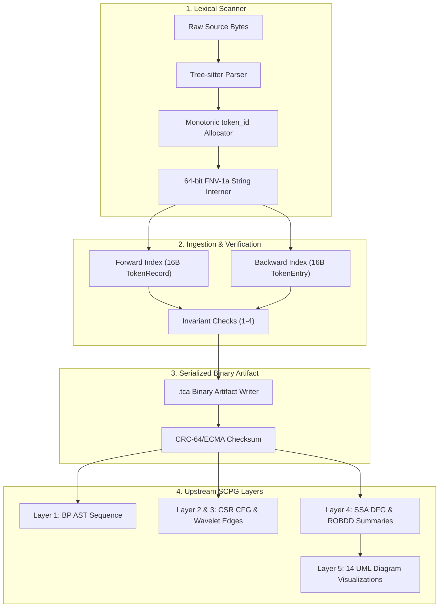
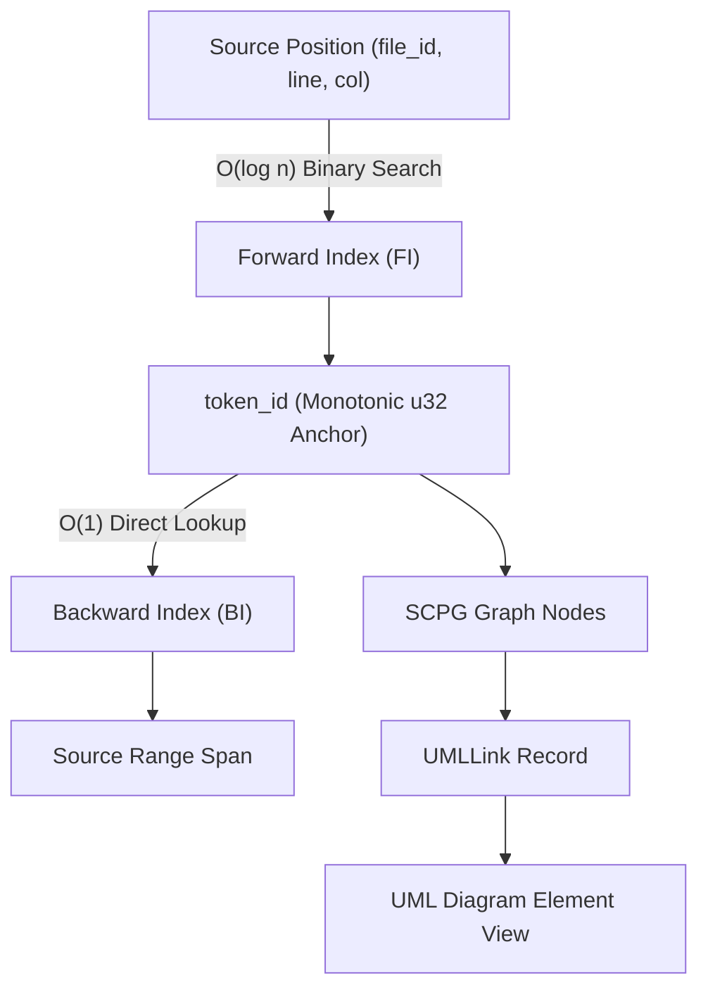
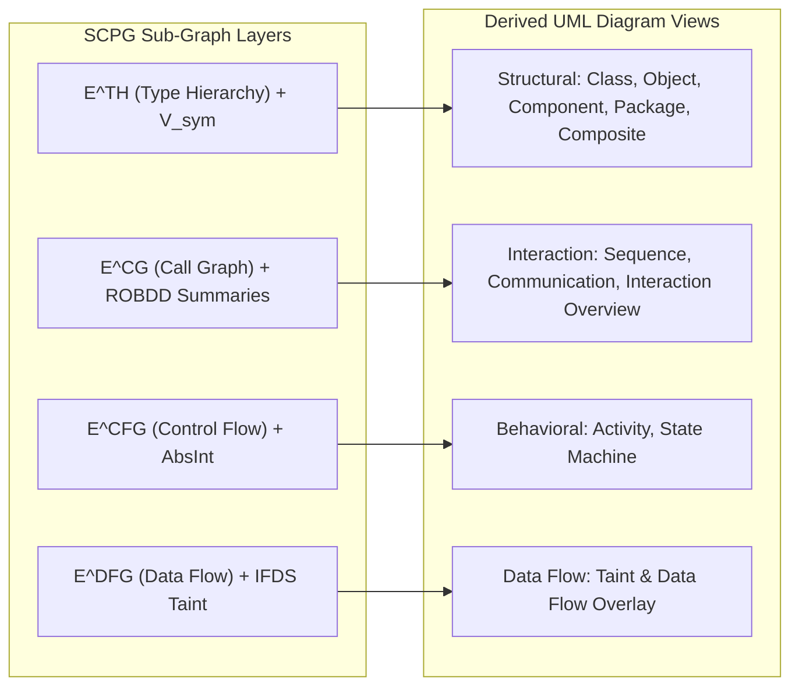

<div align="center">

# OpenHeart

### Succinct Compositional Program Graph (SCPG) Engine

[](https://www.rust-lang.org/)
[](LICENSE)
[](https://github.com/AhmadHassan-BTed/OpenHeart/actions)
[](SECURITY.md)
[-blueviolet.svg?style=flat-square)](https://github.com/AhmadHassan-BTed)

<br/>


<p align="center">
  A high-performance static program analysis engine and bidirectional UML generation platform built on succinct data structures, memory-mapped binary layouts, and formal graph representations.
</p>

</div>

---

## Overview & System Philosophy

Software codebases are human creations designed to express complex domain logic. However, existing static program analysis tools (such as legacy Code Property Graphs or lowered compiler IRs) strip away high-level intent and introduce massive memory overheads through pointer-heavy node objects.

**OpenHeart** resolves this gap. Created and maintained by **Ahmad Hassan (B-Ted)**, OpenHeart introduces the **Succinct Compositional Program Graph (SCPG)**—a unified 7-tuple graph representation:

$$\mathcal{G} = (V, E, \nu, \varepsilon, \tau, \rho, \Sigma_\Phi)$$

By combining Succinct Balanced Parentheses (BP) trees, Compressed Sparse Row (CSR) control flow graphs, Static Single-Assignment (SSA) data flow representations, and Reduced Ordered Binary Decision Diagram (ROBDD) path summaries, OpenHeart achieves up to **128× memory compression** and provides **$O(1)$ bidirectional source-to-diagram traceability**.

---

## Technical Pipeline Architecture

The ingestion pipeline converts raw source text into compact binary artifacts (`.tca`) anchored by a monotonic 32-bit `token_id` that propagates through all analysis phases.



---

## 5-Layer Succinct Storage Engine

The memory layout of OpenHeart is designed for zero-copy memory mapping and maximal CPU cache locality.

| Layer | Storage Technology | Algorithmic Guarantee | Memory vs. Legacy Graphs |
|---|---|---|---|
| **Layer 1: AST** | Balanced Parentheses (BP) + Rank/Select | $O(1)$ tree navigation (`parent`, `lca`, `subtree_size`) | **128×** vs pointer-based ASTs |
| **Layer 2: CFG** | Compressed Sparse Row (CSR) | $O(\text{outdeg})$ sequential block traversal | **9×** vs property graphs |
| **Layer 3: Edges** | Wavelet Tree over $\Sigma_E$ | $O(\log \sigma)$ type-filtered edge enumeration | **2×** bit compression |
| **Layer 4: DFG** | SSA Form + Dominance Frontiers | $O(1)$ array lookup for variable definition sites | Sparse $O(3n)$ operand storage |
| **Layer 5: Paths** | ROBDDs + Sifting Optimizer | $O(|\text{ROBDD}|)$ exact path counting (#SAT) | Compact BDD encoding |

<details>
<summary><b>Click to expand detailed mathematical formalisms</b></summary>

<br/>

### Formal Subsumption Lattice

The vertex partition forms a strict subsumption lattice:

$$V_{\text{tok}} \subset V_{\text{syn}} \subset V_{\text{bb}} \subset V_{\text{sym}}$$

- $V_{\text{tok}}$: Lexical tokens scanned from source files (AST leaves).
- $V_{\text{syn}}$: Syntactic AST internal nodes.
- $V_{\text{bb}}$: Basic blocks (maximal straight-line code sequences).
- $V_{\text{sym}}$: Symbol declarations (functions, classes, interfaces, fields, packages).

This subsumption lattice guarantees $O(1)$ projection between tokens, AST nodes, basic blocks, SSA definitions, and symbol declarations without requiring full graph re-traversals.

</details>

---

## Universal Source Traceability Protocol

Bidirectional source position linking relies on the `token_id` anchor.



---

## 14 Native UML Diagram Derivations

All 14 standard UML 2.5 diagram types are deterministically derived from SCPG graph layers:



---

## Web Repository Adapter & Portal Studio

OpenHeart includes a decoupled **Web Repository Adapter** module (`src/adapters/web_repo.rs`) and standalone Web Portal Studio (`web/`). 

This portal allows developers to paste any public Git repository link (`https://github.com/owner/repository`), select any combination of the **14 UML diagram types** via a visual selection matrix, and generate live interactive Mermaid diagrams without modifying or interfering with core library execution.

```mermaid
graph LR
    User["Developer / User"] -->|1. Paste Repo URL + Check 14 UMLs| WebPortal["Web Portal Studio (web/)"]
    WebPortal -->|2. Non-blocking Fetch & Validate| WebAdapter["src/adapters/web_repo.rs"]
    WebAdapter -->|3. Generate .tca Manifest| Engine["OpenHeart Engine"]
    Engine -->|4. Derive Selected Diagrams| Studio["Interactive Mermaid Studio"]
```



### Launch Web Studio Locally

To launch the local web studio portal:

```bash
make serve
```

Then open `http://localhost:8080` in your web browser.

```text
OpenHeart/
├── .github/
│   ├── workflows/             # CI and Release pipelines
│   ├── ISSUE_TEMPLATE/        # Standardized issue templates
│   ├── PULL_REQUEST_TEMPLATE.md
│   └── dependabot.yml         # Automated dependency configuration
├── src/
│   ├── adapters/
│   │   ├── web_repo.rs        # Decoupled Web Repository URL Fetcher & Diagram Selector
│   │   └── mod.rs
│   ├── core/
│   │   ├── io/                # Binary Little-Endian reader/writer & mmap wrapper
│   │   └── types/             # TokenRecord (16B), TokenEntry (16B), SourceFileRecord (64B)
│   ├── phase1/
│   │   ├── adapter/           # LanguageAdapter trait & JavaLanguageAdapter
│   │   ├── parser/            # Tree-sitter CST parser integration
│   │   ├── allocator.rs       # Monotonic AtomicU32 TokenIdAllocator
│   │   ├── builder.rs         # Forward/Backward index builder & invariant checks
│   │   ├── interner.rs        # FNV-1a open-addressing StringInterner
│   │   ├── serializer.rs      # Binary .tca format serializer & CRC-64 verification
│   │   └── walker.rs          # Left-to-right DFS CST leaf token walker
│   └── lib.rs                 # Root library entry point
├── web/                       # Standalone Web Portal Studio
│   ├── index.html             # Web Repository UML Studio UI
│   ├── style.css              # Dark glassmorphism CSS design system
│   └── app.js                 # Interactive 14 UML diagram renderer (Mermaid.js)
├── tests/
│   └── phase1_tests.rs        # Integration and end-to-end pipeline tests
├── docs/
│   ├── assets/                # Architecture diagrams and SVG assets
│   ├── overview.md            # Detailed SCPG mathematical specification & formal analysis
│   ├── architecture.md        # 5-Phase pipeline system architecture guide
│   ├── succinct_structures.md # BP ASTs, CSR CFGs, Wavelet Trees & ROBDD proof specs
│   ├── uml_derivation.md      # 14 UML diagram derivation rules & query formulas
│   ├── traceability_and_incremental.md # Universal token_id traceability & diff engine
│   ├── security-architecture.md# Security posture, cryptographic checksums & bounds
│   ├── codebase-guide.md      # Codebase module map & quick reference for contributors
│   ├── technical-decisions.md # Architecture Decision Records (ADR-001 to ADR-004)
│   ├── getting_started.md     # Quickstart & developer onboarding
│   └── contributing.md        # Contribution standards & commit guidelines
├── scripts/
│   └── ci_check.sh            # Local pre-flight validation script
├── Makefile                   # Automation Makefile
├── Cargo.toml                 # Rust crate manifest
├── ImplementationPlan.md      # Phase 1 technical specification
├── LICENSE                    # MIT License
├── CODE_OF_CONDUCT.md         # Contributor Covenant v2.1
├── CONTRIBUTING.md            # Contribution guidelines
├── SECURITY.md                # Vulnerability disclosure policy
├── CHANGELOG.md               # Release history
├── ROADMAP.md                 # 5-Phase development roadmap
└── SUPPORT.md                 # Support channels
```

---

## Environment Configuration

Copy `.env.example` to `.env` for local configuration overrides:

```bash
cp .env.example .env
```

Available environment options:

| Option Name | Default Value | Functional Role |
|---|---|---|
| `RUST_LOG` | `info` | Logging verbosity (`error`, `warn`, `info`, `debug`, `trace`). |
| `OPENHEART_ARTIFACT_DIR` | `./target/artifacts` | Target directory for generated `.tca` artifacts. |
| `OPENHEART_MAX_MEMORY_MB` | `2048` | Peak memory threshold limit in megabytes. |
| `OPENHEART_NUM_THREADS` | `0` | Parallel parsing thread count (`0` = auto-detect CPU cores). |
| `OPENHEART_STRICT_INVARIANTS`| `true` | Enable runtime assertions for Invariants 1–4. |

---

## Building & Developer Commands

Developer tasks are managed via the included `Makefile`:

```bash
# Run local pre-flight validation (cargo check, fmt, test)
make ci

# Build debug library
make build

# Run unit and integration test suite
make test

# Format codebase according to rustfmt
make fmt

# Generate crate documentation
make docs
```

---

## Security Posture

OpenHeart enforces strict safety and integrity controls:
- Safe Rust guarantee across ingestion modules.
- SHA-256 cryptographic digests computed for all source contents and tree states.
- CRC-64/ECMA verification required on `.tca` binary artifacts prior to deserialization.

For security reports, please review [SECURITY.md](SECURITY.md).

---

## Community & Support

Contributions, issue reports, and feedback are welcomed:
- [CONTRIBUTING.md](CONTRIBUTING.md) — Guidelines for submitting code and documentation.
- [CODE_OF_CONDUCT.md](CODE_OF_CONDUCT.md) — Standards of community engagement.
- [SUPPORT.md](SUPPORT.md) — Support options and GitHub Discussions.

---

## License & Maintainer Information

This project is open-source software licensed under the **[MIT License](LICENSE)**.

Designed, authored, and maintained by **Ahmad Hassan (B-Ted)**.
