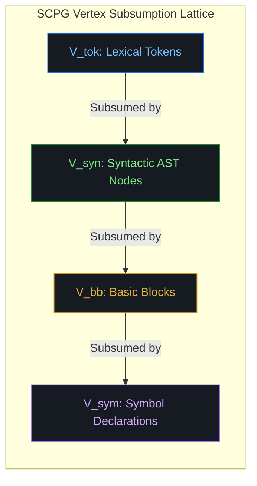
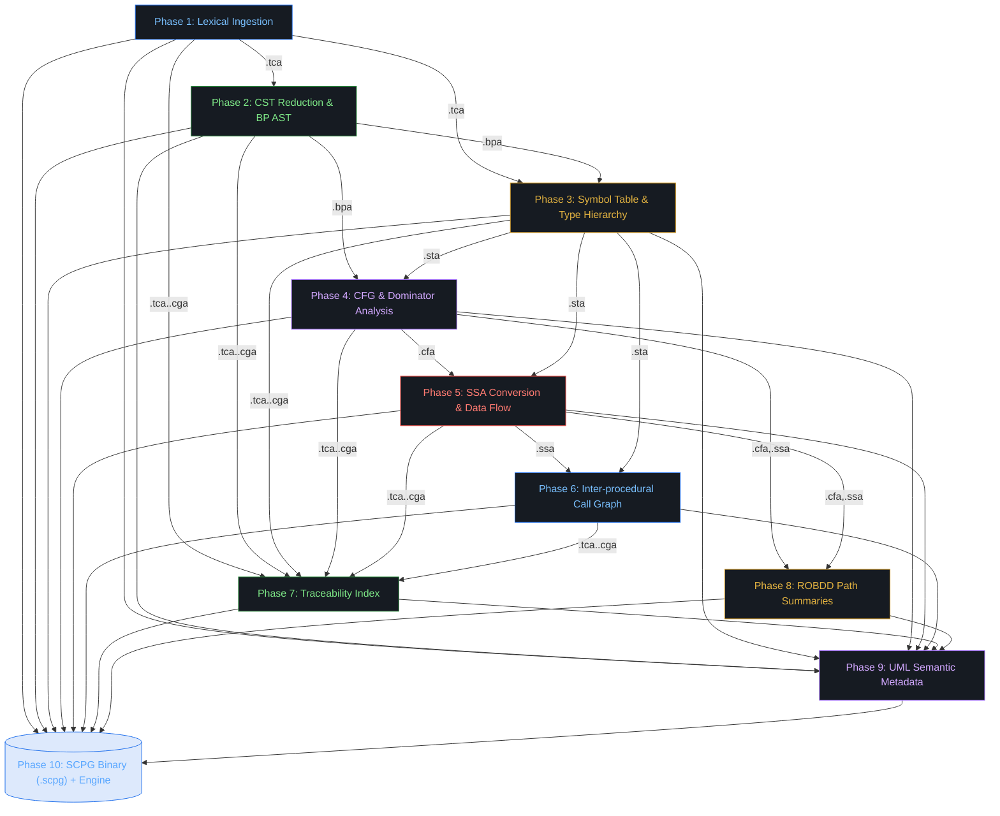
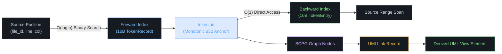
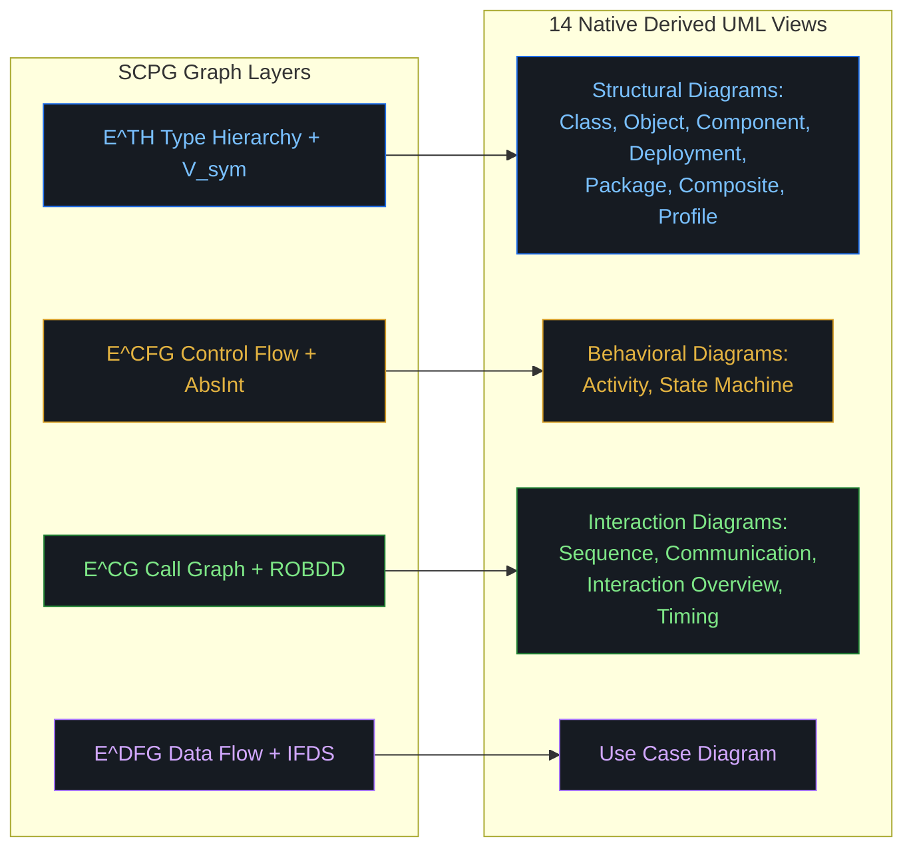
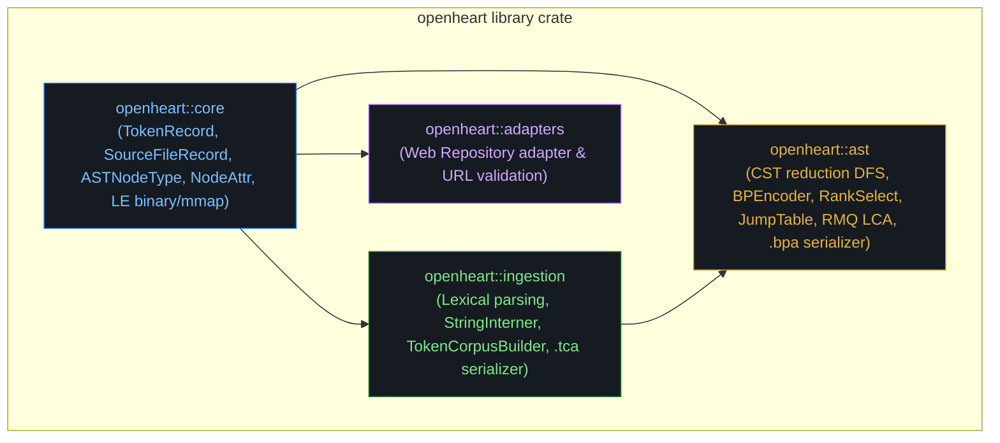
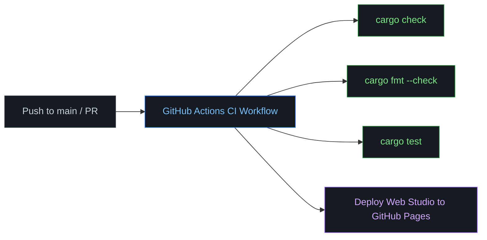

<div align="center">

# OpenHeart

### Succinct Compositional Program Graph (SCPG) Engine

[](https://www.rust-lang.org/)
[](LICENSE)
[](https://ahmadhassan-bted.github.io/OpenHeart/)
[](https://github.com/AhmadHassan-BTed/OpenHeart/actions)
[](SECURITY.md)
[-blueviolet.svg?style=flat-square)](https://github.com/AhmadHassan-BTed)

<br/>

<p align="center">
  
</p>

<p align="center">
  A high-performance static program analysis engine and bidirectional UML generation platform built on succinct data structures, memory-mapped binary layouts, and formal graph representations.
</p>

</div>

---

## System Philosophy & Human Intent

Software codebases are living artifacts of human intellect designed to express domain logic, structural design, and operational intent. Traditional program analysis frameworks—such as pointer-heavy Code Property Graphs or lowered compiler IRs—strip away this high-level context, introducing massive memory inflation and pointer-chasing latency that isolate static analysis from real-time developer workflows.

Created and authored solely by **Ahmad Hassan (B-Ted)**, **OpenHeart** bridge this gap by introducing the **Succinct Compositional Program Graph (SCPG)**—a formal 7-tuple graph representation:

$$\mathcal{G} = (V, E, \nu, \varepsilon, \tau, \rho, \Sigma_\Phi)$$

By combining Succinct Balanced Parentheses (BP) trees, Compressed Sparse Row (CSR) control flow graphs, Static Single-Assignment (SSA) data flow representations, and Reduced Ordered Binary Decision Diagram (ROBDD) path summaries, OpenHeart achieves up to **128× memory compression** while maintaining **$O(1)$ bidirectional source-to-diagram traceability**.

---

## Technical Highlights

- **128× Memory Compression**: Replaces pointer-heavy AST nodes with Succinct Balanced Parentheses (BP) trees and $O(1)$ Rank/Select indices.
- **$O(1)$ Universal Traceability**: Monotonic 32-bit `token_id` anchors link raw source positions directly to IR graph nodes and derived UML elements.
- **14 Native UML 2.5 Diagram Derivations**: Deterministically generates Class, Sequence, Activity, Component, State Machine, and 9 other UML diagram types directly from graph layers.
- **Zero-Copy Memory Mapping**: All 10 compilation pipeline phases serialize into CRC-64 verified binary artifacts mapped directly into OS page memory.

---

## System Architecture

The vertex partition set $V$ forms a strict subsumption lattice that enables direct $O(1)$ projection across syntactic, basic block, SSA, and symbol declaration layers:

$$V_{\text{tok}} \subset V_{\text{syn}} \subset V_{\text{bb}} \subset V_{\text{sym}}$$



### 5-Layer Succinct Storage Engine

| Layer | Storage Technology | Algorithmic Guarantee | Memory vs. Legacy Graphs |
|---|---|---|---|
| **Layer 1: AST** | Balanced Parentheses (BP) + Rank/Select | $O(1)$ tree navigation (`parent`, `lca`, `subtree_size`) | **128×** vs pointer-based ASTs |
| **Layer 2: CFG** | Compressed Sparse Row (CSR) | $O(\text{outdeg})$ sequential block traversal | **9×** vs property graphs |
| **Layer 3: Edges** | Wavelet Tree over $\Sigma_E$ | $O(\log \sigma)$ type-filtered edge enumeration | **2×** bit compression |
| **Layer 4: DFG** | SSA Form + Dominance Frontiers | $O(1)$ array lookup for variable definition sites | Sparse $O(3n)$ operand storage |
| **Layer 5: Paths** | ROBDDs + Sifting Optimizer | $O(|\text{ROBDD}|)$ exact path counting (#SAT) | Compact BDD encoding |

<details>
<summary><b>Formal Mathematical Specifications &amp; Subsumption Proofs</b></summary>

<br/>

Formally, an SCPG is defined as:

$$\mathcal{G} = (V, E, \nu, \varepsilon, \tau, \rho, \Sigma_\Phi)$$

Where:
- $V = V_{\text{tok}} \sqcup V_{\text{syn}} \sqcup V_{\text{bb}} \sqcup V_{\text{ssa}} \sqcup V_{\text{sym}}$ is the partitioned vertex set.
- $E \subseteq V \times V \times \Sigma_E$ is the typed edge set across six specialized sub-graphs.
- $\tau: V_{\text{tok}} \to \mathbb{N}^4$ assigns source locations $(\text{file\_id}, \text{line}, \text{col}, \text{len})$.
- $\Sigma_\Phi$ represents Reduced Ordered Binary Decision Diagrams (ROBDDs) encoding feasible path sets per function.

For full mathematical proofs, refer to [docs/architecture.md](docs/architecture.md) and [docs/overview.md](docs/overview.md).

</details>

---

## 10-Phase Compilation Pipeline

The OpenHeart pipeline transforms raw source files into binary artifacts through ten deterministic, independent analysis stages:



| Phase | Pipeline Stage | Primary Inputs | Serialized Artifact | Key Responsibility |
|---|---|---|---|---|
| **1** | **Lexical Ingestion** | Source text | `TokenCorpusArtifact (.tca)` | FNV-1a string interning, sorted forward index, `token_id` allocation. |
| **2** | **CST Reduction & BP Encoding** | `.tca` artifact | `BPASTArtifact (.bpa)` | Reduced ordinal AST forest, 2-bit/node BP bitstring, jump table, RMQ LCA. |
| **3** | **Symbol Table & Type Hierarchy** | `.tca`, `.bpa` | `SymbolTableArtifact (.sta)` | Scope resolution, symbol declaration DAG ($V_{\text{sym}}$), $E^{\text{TH}}$ type relations. |
| **4** | **CFG & Dominator Analysis** | `.bpa`, `.sta` | `CFGArtifact (.cfa)` | Basic block partitioning ($V_{\text{bb}}$), CSR adjacency lists, Lengauer-Tarjan dominators. |
| **5** | **SSA Conversion & Data Flow** | `.cfa`, `.sta` | `SSAArtifact (.ssa)` | Iterated dominance frontiers (Cytron 1991), $\phi$-functions, IFDS taint propagation. |
| **6** | **Inter-procedural Call Graph** | `.ssa`, `.sta` | `CallGraphArtifact (.cga)` | Call graph ($E^{\text{CG}}$) derivation, class hierarchy analysis, $k$-CFA points-to analysis. |
| **7** | **Traceability Index** | `.tca` through `.cga` | `TraceabilityArtifact (.tra)` | Bidirectional Forward Index (source $\rightarrow$ IR) & dense Backward Index (IR $\rightarrow$ source). |
| **8** | **ROBDD Path Summaries** | `.cfa`, `.ssa` | `PathSummaryArtifact (.psa)` | Reduced Ordered BDD path boolean functions ($f_{\text{paths}}$), FORCE/sifting reordering. |
| **9** | **UML Semantic Metadata** | Artifacts 1–8 | `UMLMetadataArtifact (.uma)` | Synthesis of $\rho$ mapping functions for all 14 standard UML diagram views. |
| **10**| **SCPG Query Bootstrap** | Artifacts 1–9 | `SCPG Binary (.scpg)` | 11-section memory-mapped `.scpg` binary file & CFL-reachability query engine. |

---

## Data Flow & Traceability Protocol

Source location tracking operates through a monotonic `token_id` anchor.



---

## 14 Native UML Diagram Visualizations

All 14 standard UML 2.5 diagram types are derived directly from SCPG graph layers:



---

## Codebase Architecture & Internal Module Structure



### Repository Structure

```text
OpenHeart/
├── .github/
│   ├── workflows/             # CI and GitHub Pages deployment automation
│   ├── ISSUE_TEMPLATE/        # Issue reporting templates
│   └── PULL_REQUEST_TEMPLATE.md
├── src/
│   ├── core/                  # Language-agnostic types & Little-Endian binary I/O primitives
│   │   ├── io/                # BinaryWriter, BinaryReader, MemoryMappedFile, CRC-64
│   │   └── types/             # TokenRecord, BPARecord, SymbolRecord, CFGRecord, SSARecord
│   ├── ingestion/             # Lexical Ingestion & Token Corpus (.tca) (Phase 1)
│   │   ├── adapter/           # Tree-sitter LanguageAdapter & Java scanner
│   │   ├── interner.rs        # FNV-1a StringInterner
│   │   └── serializer.rs      # Binary .tca format serializer/deserializer
│   ├── ast/                   # CST Reduction & BP AST Encoding (.bpa) (Phase 2)
│   │   ├── bp_encoder.rs      # Bit-packed 2-bit BP bitstring
│   │   ├── rank_select.rs     # Jacobson O(1) Rank/Select auxiliary indices
│   │   ├── rmq.rs             # Sparse Table RMQ for O(1) LCA queries
│   │   └── serializer.rs      # Binary .bpa format serializer/deserializer
│   ├── symbol/                # Symbol Table & Type Hierarchy (.sta) (Phase 3)
│   │   ├── passes/            # 5-pass DFS symbol discovery & scope graph resolution
│   │   └── serializer.rs      # Binary .sta format serializer/deserializer
│   ├── cfg/                   # Control Flow Graph & Dominators (.cfa) (Phase 4)
│   │   ├── stmts/             # CFG statement edge builders (if, while, for, try-catch)
│   │   ├── dominators.rs      # Cooper iterative immediate dominators (idom[])
│   │   └── serializer.rs      # Binary .cfa format serializer/deserializer
│   ├── ssa/                   # SSA Conversion, CDG & IFDS Engine (.ssa) (Phase 5)
│   │   ├── liveness.rs        # Pruned SSA backward liveness fixpoint
│   │   ├── placement.rs       # Cytron φ-function placement worklist
│   │   ├── renaming.rs        # Dominator tree DFS renaming & VersionStack
│   │   ├── cdg.rs             # Control Dependence Graph via reversed post-dominators
│   │   ├── ifds.rs            # Reps-Horwitz-Sagiv polynomial IFDS solvers
│   │   └── serializer.rs      # Binary .ssa format serializer/deserializer
│   ├── main.rs                # CLI binary executable (analyze, inspect)
│   └── lib.rs                 # Library crate root
├── web/                       # Standalone Web Portal Studio & Interactive Visualizers
├── tests/
│   ├── ingestion_tests.rs     # Phase 1 Lexical Ingestion integration tests
│   ├── ast_tests.rs           # Phase 2 BP AST & Rank/Select tests
│   ├── symbol_tests.rs        # Phase 3 Symbol Table & Scope Graph tests
│   ├── cfg_tests.rs           # Phase 4 CFG & Dominator Tree tests
│   ├── ssa_tests.rs           # Phase 5 SSA Conversion & IFDS tests
│   └── pipeline_accuracy_tests.rs # Multi-Phase line-by-line pipeline accuracy tests
├── docs/                      # Technical specifications, architecture guides, and plans
├── scripts/
│   └── ci_check.sh            # Pre-flight local CI validation script
├── Makefile                   # Developer automation commands
├── Cargo.toml                 # Rust crate manifest
└── LICENSE                    # MIT License
```

---

## Live Web Studio & Quickstart

OpenHeart provides an interactive Web Portal Studio hosted on GitHub Pages:

👉 **[Launch OpenHeart Web Studio Portal](https://ahmadhassan-bted.github.io/OpenHeart/)**

Paste any public GitHub repository link (`https://github.com/owner/repo`) to select from all 14 UML diagram types and generate live interactive Mermaid diagrams.

### Developer Commands

```bash
# Clone repository
git clone https://github.com/AhmadHassan-BTed/OpenHeart.git
cd OpenHeart

# Run pre-flight CI validation (cargo check, fmt, test)
make ci

# Run test suite
make test

# Launch local Web Studio server (port 8080)
make serve
```

---

## Build & CI/CD Deployment Pipeline



---

## Security & Maintainer Information

OpenHeart enforces safety controls through safe Rust, cryptographic SHA-256 digests, and CRC-64 checksum verification on binary artifacts. For security vulnerability reporting, review [SECURITY.md](SECURITY.md).

This project is open-source software licensed under the **[MIT License](LICENSE)**.

Designed, authored, and maintained solely by **Ahmad Hassan (B-Ted)**.
