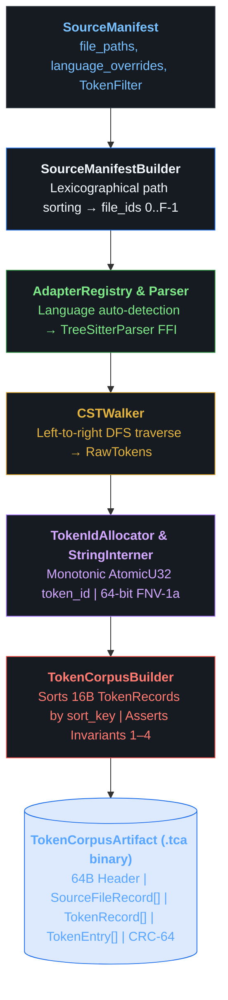
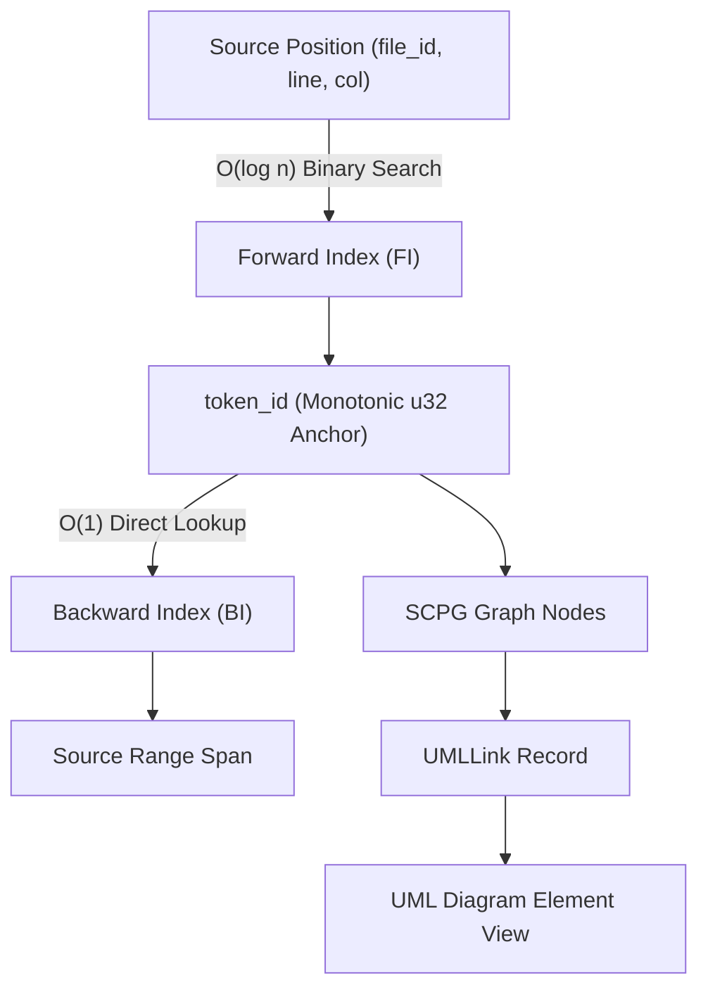
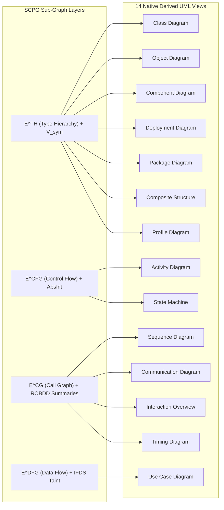

<div align="center">

# OpenHeart

### Succinct Compositional Program Graph (SCPG) Engine

[](https://www.rust-lang.org/)
[](LICENSE)
[](https://ahmadhassan-bted.github.io/OpenHeart/)
[](https://github.com/AhmadHassan-BTed/OpenHeart/actions)
[](SECURITY.md)
[-blueviolet.svg?style=flat-square)](https://github.com/AhmadHassan-BTed)

<br/>

<p align="center">
  
</p>

<p align="center">
  A high-performance static program analysis engine and bidirectional UML generation platform built on succinct data structures, memory-mapped binary layouts, and formal graph representations.
</p>

</div>

---

## Overview & System Philosophy

Software codebases are human creations designed to express complex domain logic. However, existing static program analysis tools (such as legacy Code Property Graphs or lowered compiler IRs) strip away high-level intent and introduce massive memory overheads through pointer-heavy node objects.

**OpenHeart** resolves this gap. Created and maintained by **Ahmad Hassan (B-Ted)**, OpenHeart introduces the **Succinct Compositional Program Graph (SCPG)**—a unified 7-tuple graph representation:

$$\mathcal{G} = (V, E, \nu, \varepsilon, \tau, \rho, \Sigma_\Phi)$$

By combining Succinct Balanced Parentheses (BP) trees, Compressed Sparse Row (CSR) control flow graphs, Static Single-Assignment (SSA) data flow representations, and Reduced Ordered Binary Decision Diagram (ROBDD) path summaries, OpenHeart achieves up to **128× memory compression** and provides **$O(1)$ bidirectional source-to-diagram traceability**.

---

## Complete 10-Phase Pipeline Architecture

The OpenHeart analysis engine is structured into a 10-phase pipeline, where each phase produces an immutable, binary artifact with CRC-64 verification:

| Phase | Pipeline Stage | Primary Inputs | Serialized Artifact | Key Responsibility |
|---|---|---|---|---|
| **1** | **Lexical Ingestion** | Source text | `TokenCorpusArtifact (.tca)` | FNV-1a string interning, sorted forward index, `token_id` allocation. |
| **2** | **CST Reduction & BP Encoding** | `.tca` artifact | `BPASTArtifact (.bpa)` | Reduced ordinal AST forest, 2-bit/node BP bitstring, jump table, RMQ LCA. |
| **3** | **Symbol Table & Type Hierarchy** | `.tca`, `.bpa` | `SymbolTableArtifact (.sta)` | Scope resolution, symbol declaration DAG ($V_{\text{sym}}$), $E^{\text{TH}}$ type relations. |
| **4** | **CFG & Dominator Analysis** | `.bpa`, `.sta` | `CFGArtifact (.cfa)` | Basic block partitioning ($V_{\text{bb}}$), CSR adjacency lists, Lengauer-Tarjan dominators. |
| **5** | **SSA Conversion & Data Flow** | `.cfa`, `.sta` | `SSAArtifact (.ssa)` | Iterated dominance frontiers (Cytron 1991), $\phi$-functions, IFDS taint propagation. |
| **6** | **Inter-procedural Call Graph** | `.ssa`, `.sta` | `CallGraphArtifact (.cga)` | Call graph ($E^{\text{CG}}$) derivation, class hierarchy analysis, $k$-CFA points-to analysis. |
| **7** | **Traceability Index** | `.tca` through `.cga` | `TraceabilityArtifact (.tra)` | Bidirectional Forward Index (source $\rightarrow$ IR) & dense Backward Index (IR $\rightarrow$ source). |
| **8** | **ROBDD Path Summaries** | `.cfa`, `.ssa` | `PathSummaryArtifact (.psa)` | Reduced Ordered BDD path boolean functions ($f_{\text{paths}}$), FORCE/sifting reordering. |
| **9** | **UML Semantic Metadata** | Artifacts 1–8 | `UMLMetadataArtifact (.uma)` | Synthesis of $\rho$ mapping functions for all 14 standard UML diagram views. |
| **10**| **SCPG Query Bootstrap** | Artifacts 1–9 | `SCPG Binary (.scpg)` | 11-section memory-mapped `.scpg` binary file & CFL-reachability query engine. |

---

## Phase 1: Ingestion Module Flow & Pipeline Architecture



---

## Phase 2: CST Reduction & Balanced Parentheses AST Encoding

```mermaid
flowchart TD
    subgraph Legend["Reduction Decision Taxonomy"]
        direction LR
        L1["KEEP → AST node"] ::: keep
        L2["ELIMINATE → flatten children up"] ::: elim
        L3["DROP → discard"] ::: drop
        L4["token → leaf AST node"] ::: tok
    end

    IF["if_statement<br/><b>KEEP → NN_IF_STMT</b>"] ::: keep
    IF_KW["if<br/><b>DROP</b>"] ::: drop
    PAREN["parenthesized_expression<br/><b>ELIMINATE → flatten children</b>"] ::: elim
    RET["return_statement<br/><b>KEEP → NN_RETURN_STMT</b>"] ::: keep

    IF --> IF_KW
    IF --> PAREN
    IF --> RET

    BIN["binary_expression<br/><b>KEEP → NN_BINARY_EXPR</b>"] ::: keep
    ID1["identifier 'x'<br/><b>KEEP → leaf token</b>"] ::: tok
    OP[">&quot;<br/><b>DROP</b>"] ::: drop
    LIT["decimal_integer_literal '0'<br/><b>KEEP → leaf token</b>"] ::: tok

    PAREN --> BIN
    BIN --> ID1
    BIN --> OP
    BIN --> LIT

    RET_KW["return<br/><b>DROP</b>"] ::: drop
    ID2["identifier 'x'<br/><b>KEEP → leaf token</b>"] ::: tok
    SEMI[";<br/><b>DROP</b>"] ::: drop

    RET --> RET_KW
    RET --> ID2
    RET --> SEMI

    classDef keep fill:#23863640,stroke:#238636,color:#7ee787
    classDef elim fill:#a371f740,stroke:#a371f7,color:#d2a8ff
    classDef drop fill:#f8514940,stroke:#f85149,color:#ff7b72
    classDef tok fill:#1f6feb40,stroke:#1f6feb,color:#79c0ff
```

```text
BP Bitstring:  1  1  1  0  1  0  0  1  1  0  0  0
               (1 = Open / Pre-order visit, 0 = Close / Post-order exit, 5 nodes = 10 bits)
```

---

## Performance & Complexity Analysis

### Algorithmic & Space Bounds

- **Overall Ingestion Complexity**: $O(N + n_{\text{ast}} \log n_{\text{ast}})$ (dominated by sparse table RMQ preprocessing; $\sim 21\text{ms}$ per million AST nodes).
- **Traceability Lookup**: $O(\log n)$ Forward Index binary search, $O(1)$ direct Backward Index array lookup.
- **Tree Navigation**: $O(1)$ `parent`, `first_child`, `next_sibling`, `subtree_size`, and `lca` via BP bits and Rank/Select auxiliary structures.
- **Space Reduction**: **$6.9\times$ to $128\times$ smaller** memory footprint compared to pointer-based ASTs and graph database baselines (e.g. Neo4j).

---

## 5-Layer Succinct Storage Engine

The memory layout of OpenHeart is designed for zero-copy memory mapping and maximal CPU cache locality.

| Layer | Storage Technology | Algorithmic Guarantee | Memory vs. Legacy Graphs |
|---|---|---|---|
| **Layer 1: AST** | Balanced Parentheses (BP) + Rank/Select | $O(1)$ tree navigation (`parent`, `lca`, `subtree_size`) | **128×** vs pointer-based ASTs |
| **Layer 2: CFG** | Compressed Sparse Row (CSR) | $O(\text{outdeg})$ sequential block traversal | **9×** vs property graphs |
| **Layer 3: Edges** | Wavelet Tree over $\Sigma_E$ | $O(\log \sigma)$ type-filtered edge enumeration | **2×** bit compression |
| **Layer 4: DFG** | SSA Form + Dominance Frontiers | $O(1)$ array lookup for variable definition sites | Sparse $O(3n)$ operand storage |
| **Layer 5: Paths** | ROBDDs + Sifting Optimizer | $O(|\text{ROBDD}|)$ exact path counting (#SAT) | Compact BDD encoding |

---

## Universal Source Traceability Protocol

Bidirectional source position linking relies on the `token_id` anchor.



---

## 14 Native UML Diagram Visualizations

OpenHeart natively derives all 14 standard UML 2.5 diagram types directly from graph layers:



---

## Web Repository Adapter & Studio Portal

OpenHeart includes a decoupled **Web Repository Adapter** module (`src/adapters/web_repo.rs`) and standalone Web Portal Studio (`web/`). 

This portal allows developers to paste any public Git repository link (`https://github.com/owner/repository`), select any combination of the **14 UML diagram types** via a visual selection matrix, filter by module or system scope, and generate live interactive Mermaid diagrams.

### Launch Web Studio Locally

To launch the local web studio portal:

```bash
make serve
```

Then open `http://localhost:8080` in your web browser, or access the live deployed instance directly at **[https://ahmadhassan-bted.github.io/OpenHeart/](https://ahmadhassan-bted.github.io/OpenHeart/)**.

---

## Directory Structure

```text
OpenHeart/
├── .github/
│   ├── workflows/             # CI and GitHub Pages deployment pipelines
│   ├── ISSUE_TEMPLATE/        # Standardized issue templates
│   ├── PULL_REQUEST_TEMPLATE.md
│   └── dependabot.yml         # Automated dependency configuration
├── src/
│   ├── adapters/
│   │   ├── web_repo.rs        # Decoupled Web Repository URL Fetcher & Diagram Selector
│   │   └── mod.rs
│   ├── core/
│   │   ├── io/                # Binary Little-Endian reader/writer & mmap wrapper
│   │   └── types/             # TokenRecord (16B), TokenEntry (16B), ASTNodeType, NodeAttr
│   ├── ingestion/             # Lexical Ingestion & Token Corpus (.tca) (Phase 1)
│   │   ├── adapter/           # LanguageAdapter trait & JavaLanguageAdapter
│   │   ├── parser/            # Tree-sitter CST parser integration
│   │   ├── allocator.rs       # Monotonic AtomicU32 TokenIdAllocator
│   │   ├── builder.rs         # Forward/Backward index builder & invariant checks
│   │   ├── interner.rs        # FNV-1a open-addressing StringInterner
│   │   ├── serializer.rs      # Binary .tca format serializer & CRC-64 verification
│   │   └── walker.rs          # Left-to-right DFS CST leaf token walker
│   ├── ast/                   # CST Reduction & BP AST Encoding (.bpa) (Phase 2)
│   │   ├── adapter/           # ASTReductionAdapter trait & JavaASTReductionAdapter
│   │   ├── bp_encoder.rs      # MSB-first packed BPEncoder (u64 bitstring)
│   │   ├── builder.rs         # BPASTBuilder aggregating BP & Preorder arrays
│   │   ├── jump_table.rs      # O(n) stack-built match_pos lookup table
│   │   ├── preorder.rs        # Parallel node_types, node_attrs, token_ranges, parent_map
│   │   ├── rank_select.rs     # O(1) rank1 & select1 popcount auxiliary index
│   │   ├── reducer.rs         # Recursive CST reduction DFS walk
│   │   ├── rmq.rs             # Sparse Table RMQ over excess sequence for O(1) LCA
│   │   └── serializer.rs      # Binary .bpa format serializer & CRC-64 verification
│   └── lib.rs                 # Root library entry point
├── web/                       # Standalone Web Portal Studio
│   ├── index.html             # Web Repository UML Studio UI
│   ├── style.css              # Dark glassmorphism CSS design system
│   ├── app.js                 # Interactive 14 UML diagram renderer (Mermaid.js)
│   └── favicon.svg            # Minimal line-art 3D spiky orb tab logo
├── tests/
│   ├── ingestion_tests.rs     # Ingestion & Token Corpus integration tests
│   └── ast_tests.rs           # BP AST Encoding & Invariants 1-5 integration tests
├── docs/
│   ├── architecture/          # SCPG 5-layer system architecture spec
│   │   └── scpg_architecture_diagram.html
│   ├── ast/                   # Phase 2 BP AST encoding spec
│   │   └── phase2_bp_architecture.html
│   ├── ingestion/             # Phase 1 Lexical ingestion spec
│   │   └── phase1_architecture_and_bit_layout.html
│   ├── pipeline/              # 10-Phase pipeline spec
│   │   └── openheart_10_phase_pipeline.html
│   ├── assets/                # Rendered SVG assets
│   │   └── scpg_overview.svg
│   ├── overview.md            # Detailed SCPG mathematical specification & formal analysis
│   ├── architecture.md        # 10-Phase pipeline system architecture guide
│   └── technical-decisions.md # Architecture Decision Records (ADR-001 to ADR-004)
├── scripts/
│   └── ci_check.sh            # Local pre-flight validation script
├── Makefile                   # Automation Makefile
├── Cargo.toml                 # Rust crate manifest
├── ImplementationPlan.md      # Phase 1 technical specification
├── Implementation_plan2.md    # Phase 2 technical specification
├── LICENSE                    # MIT License
├── CODE_OF_CONDUCT.md         # Contributor Covenant v2.1
├── CONTRIBUTING.md            # Contribution guidelines
├── SECURITY.md                # Vulnerability disclosure policy
├── CHANGELOG.md               # Release history
└── ROADMAP.md                 # 10-Phase development roadmap
```

---

## Environment Configuration

Copy `.env.example` to `.env` for local configuration overrides:

```bash
cp .env.example .env
```

| Option Name | Default Value | Functional Role |
|---|---|---|
| `RUST_LOG` | `info` | Logging verbosity (`error`, `warn`, `info`, `debug`, `trace`). |
| `OPENHEART_ARTIFACT_DIR` | `./target/artifacts` | Target directory for generated `.tca` and `.bpa` artifacts. |
| `OPENHEART_MAX_MEMORY_MB` | `2048` | Peak memory threshold limit in megabytes. |
| `OPENHEART_NUM_THREADS` | `0` | Parallel parsing thread count (`0` = auto-detect CPU cores). |
| `OPENHEART_STRICT_INVARIANTS`| `true` | Enable runtime assertions for Invariants 1–5. |

---

## Building & Developer Commands

Developer tasks are managed via the included `Makefile`:

```bash
# Run local pre-flight validation (cargo check, fmt, test)
make ci

# Build debug library
make build

# Run unit and integration test suite
make test

# Format codebase according to rustfmt
make fmt

# Launch local Web Portal Studio
make serve
```

---

## Security Posture

OpenHeart enforces strict safety and integrity controls:
- Safe Rust guarantee across ingestion and AST reduction modules.
- SHA-256 cryptographic digests computed for all source contents and tree states.
- CRC-64/ECMA verification required on `.tca` and `.bpa` binary artifacts prior to deserialization.

For security reports, please review [SECURITY.md](SECURITY.md).

---

## License & Maintainer Information

This project is open-source software licensed under the **[MIT License](LICENSE)**.

Designed, authored, and maintained by **Ahmad Hassan (B-Ted)**.
