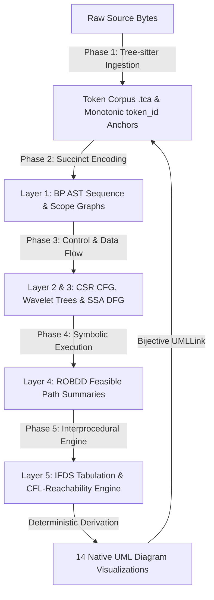
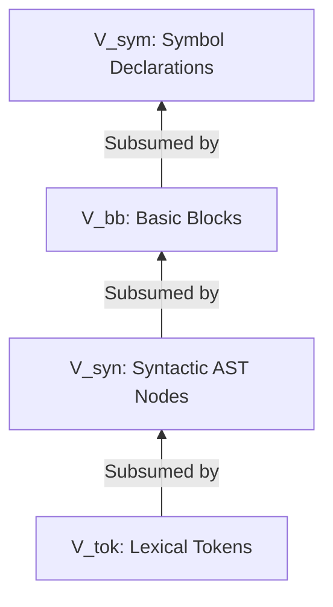
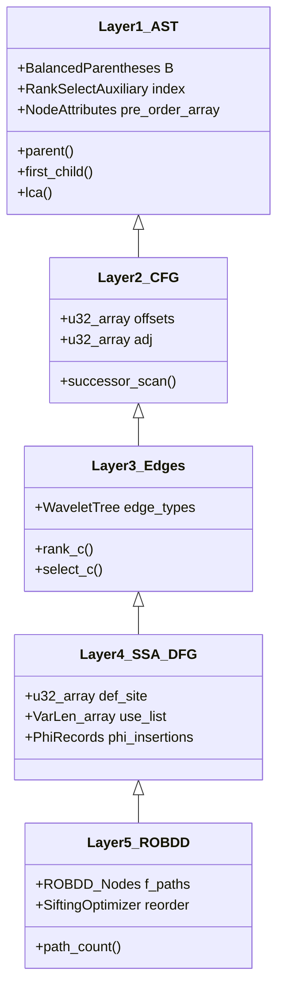
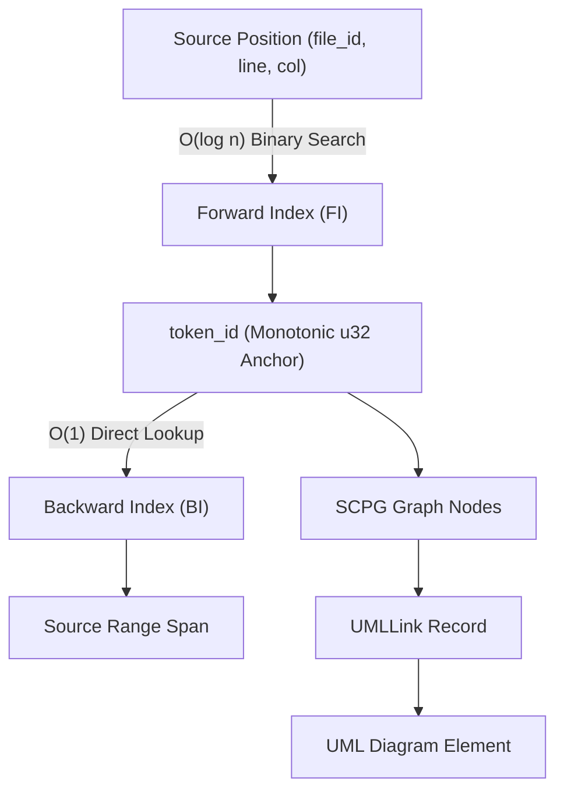

# Succinct Compositional Program Graph (SCPG) — Complete Architecture Specification

## 1. System Philosophy & Architectural Vision

The **Succinct Compositional Program Graph (SCPG)** is an advanced static program analysis graph and bidirectional UML generation engine created and maintained by **Ahmad Hassan (B-Ted)**.

Existing static analysis frameworks (e.g., Joern Code Property Graph, LLVM IR, WALA, Eclipse EMF) suffer from severe memory inflation and pointer-chasing latency. The SCPG architecture solves these structural limitations by unifying Abstract Syntax Trees (AST), Control Flow Graphs (CFG), Data Flow Graphs (DFG), Call Graphs (CG), and Type Hierarchies (TH) into a succinct, cache-line aligned, memory-mapped graph representation.

---

## 2. Formal Mathematical Definition of SCPG

Formally, an SCPG is defined as a 7-tuple:

$$\mathcal{G} = (V, E, \nu, \varepsilon, \tau, \rho, \Sigma_\Phi)$$

### 2.1 Vertex Partition & Subsumption Lattice

The finite vertex set $V$ is partitioned into five disjoint sub-domains:

$$V = V_{\text{tok}} \sqcup V_{\text{syn}} \sqcup V_{\text{bb}} \sqcup V_{\text{ssa}} \sqcup V_{\text{sym}}$$

- $V_{\text{tok}}$: Lexical tokens scanned from source files (AST leaves).
- $V_{\text{syn}}$: Syntactic AST internal nodes.
- $V_{\text{bb}}$: Basic blocks (maximal straight-line code sequences).
- $V_{\text{ssa}}$: Variable definitions in Static Single-Assignment (SSA) form.
- $V_{\text{sym}}$: Symbol declarations (functions, classes, interfaces, fields, packages).

These vertex partitions form a strict subsumption lattice:

$$V_{\text{tok}} \subset V_{\text{syn}} \subset V_{\text{bb}} \subset V_{\text{sym}}$$

This subsumption lattice guarantees $O(1)$ bidirectional projection across graph layers without recursive graph traversals.

### 2.2 Typed Edge Alphabet ($\Sigma_E$)

The edge set $E \subseteq V \times V \times \Sigma_E$ encompasses six specialized sub-graphs:

$$\Sigma_E = \{ \text{AST\_CHILD}, \text{CFG\_TRUE}, \text{CFG\_FALSE}, \text{CFG\_UNCOND}, \text{DFG\_DEF}, \text{DFG\_USE}, \text{CDG\_TRUE}, \text{CDG\_FALSE}, \text{CG\_CALL}, \text{CG\_RETURN}, \text{TH\_EXTENDS}, \text{TH\_IMPLEMENTS}, \text{TH\_USES} \}$$

- $E^{\text{AST}}$: Abstract Syntax Tree child parent edges.
- $E^{\text{CFG}}$: Intraprocedural Control Flow edges.
- $E^{\text{DFG}}$: Data Flow def-use dependency edges.
- $E^{\text{CDG}}$: Control Dependence edges derived from dominator trees.
- $E^{\text{CG}}$: Interprocedural Call Graph call/return edges.
- $E^{\text{TH}}$: Type Hierarchy extension, implementation, and usage edges.

---

## 3. The 5-Layer Succinct Storage Engine

### 3.1 Layer 1 — AST via Balanced Parentheses (BP)
- Encodes tree hierarchy into a parenthesis bit sequence $B \in \{(, )\}^{2n_{\text{ast}}}$.
- Equipped with Sadakane/Munro-Raman rank/select auxiliary structures supporting $O(1)$ operations: `findopen`, `findclose`, `enclose`, `parent`, `first_child`, `next_sibling`, `subtree_size`, and `LCA`.
- **Memory Compression**: 1,000,000 AST nodes require **~4.65 MB** vs. **32 MB** for traditional pointer-based trees ($6.9\times$ structure compression).

### 3.2 Layer 2 & 3 — CFG via Compressed Sparse Row (CSR) & Wavelet Trees
- Stores control flow adjacencies in packed arrays `offsets[0..n_bb]` and `adj[0..m_cfg]`.
- Edge types $\Sigma_E$ are encoded in a Wavelet Tree, enabling $O(\log \sigma)$ type-filtered edge enumeration (e.g., retrieving only `CFG_TRUE` branches without scanning unrelated incident edges).

### 3.3 Layer 4 — SSA Form and DFG Encoding
- Static Single-Assignment (SSA) conversion using iterated dominance frontiers ($\phi$-functions).
- Variable definitions indexed directly in $O(1)$ by variable ID; use lists stored in variable-length byte buffers.

### 3.4 Layer 5 — ROBDD Feasible Path Summaries
- Encodes feasible intraprocedural paths as a Boolean function $f_{\text{paths}}$ using Reduced Ordered Binary Decision Diagrams (ROBDDs).
- Employs Shannon expansion, complement edges, and Rudell's sifting optimization for dynamic variable reordering.
- Enables $O(|\text{ROBDD}|)$ exact path counting (#SAT) and path feasibility verification.

---

## 4. Universal Source Traceability Protocol

The traceability system relies on a monotonic 32-bit `token_id` assigned during Phase 1 lexical scanning that acts as a universal anchor across all 5 layers.

- **Forward Index ($O(\log n)$)**: Sorted array mapping packed $u48$ key `(file_id, line, col)` to `token_id`.
- **Backward Index ($O(1)$)**: Direct array lookup `BI[token_id]` returning `(file_id, line, col, len)`.
- **UML Element Link**: Embeds `UMLLink` record (`node_id`, `file_id`, `line_start`, `col_start`, `line_end`, `col_end`, `scpg_hash`) into every generated diagram element for $O(1)$ stale link detection upon source edits.

---

## 5. 14 UML Diagrams Native Generation Matrix

| UML Diagram | Category | SCPG Graph Layer Source | Derivation Engine |
|---|---|---|---|
| **[1] Class Diagram** | Structural | $E^{\text{TH}}$ (Type Hierarchy) + $V_{\text{sym}}$ | Scope Graphs & Visibility Filters |
| **[2] Object Diagram** | Structural | $E^{\text{TH}}$ + SSA Value Instances | Concrete Instance Evaluation |
| **[3] Component Diagram** | Structural | $V_{\text{sym}}$ Package/Module Symbols | Dependency Bundling |
| **[4] Deployment Diagram** | Structural | $V_{\text{sym}}$ + Artifact Metadata | Deployment Node Mapping |
| **[5] Package Diagram** | Structural | $V_{\text{sym}}$ Namespace Nodes | Package Containment Resolution |
| **[6] Composite Structure** | Structural | Internal Class Field Symbols | Port & Connector Mapping |
| **[7] Profile Diagram** | Structural | Stereotype Metadata Records | Profile Stereotype Injection |
| **[8] Use Case Diagram** | Behavioral | API Public Surface + Actor Metadata | Boundary & Goal Classification |
| **[9] Activity Diagram** | Behavioral | $E^{\text{CFG}}$ + CDG Dominator Trees | Structured Control Flow Translation |
| **[10] State Machine** | Behavioral | $E^{\text{CFG}}$ + Abstract Interpretation | Octagon / Finite Automaton State Lattices |
| **[11] Sequence Diagram** | Interaction | $E^{\text{CG}}$ (Call Graph) + ROBDD Paths | Message Lifeline Tracing |
| **[12] Communication** | Interaction | $E^{\text{CG}}$ + Message Order | Lifeline Edge Enumeration |
| **[13] Interaction Overview**| Interaction | High-Level Control Flow + Calls | CFG-to-Sequence Composite Mapping |
| **[14] Timing Diagram** | Interaction | State Transitions + Time Bounds | Temporal Trace Constraint Engine |

---

## 6. Phase Specifications & Reference Models

Each pipeline stage is defined in detail by its technical specification and interactive model:

- **Phase 1: Lexical Ingestion & Token Corpus (.tca)**
  - Technical Specification: [docs/plans/phase1_ingestion_spec.md](plans/phase1_ingestion_spec.md)
  - Interactive Spec Model: [docs/ingestion/phase1_architecture_and_bit_layout.html](ingestion/phase1_architecture_and_bit_layout.html)

- **Phase 2: CST Reduction & BP AST Encoding (.bpa)**
  - Technical Specification: [docs/plans/phase2_ast_reduction_spec.md](plans/phase2_ast_reduction_spec.md)
  - Interactive Spec Model: [docs/ast/phase2_bp_architecture.html](ast/phase2_bp_architecture.html)

- **Complete SCPG 10-Phase Pipeline Architecture**
  - Interactive Pipeline Model: [docs/pipeline/openheart_10_phase_pipeline.html](file:///home/leech/Projects/OpenHeart/docs/pipeline/openheart_10_phase_pipeline.html)

- **SCPG 5-Layer System Architecture**
  - Interactive Architecture Model: [docs/architecture/scpg_architecture_diagram.html](file:///home/leech/Projects/OpenHeart/docs/architecture/scpg_architecture_diagram.html)

