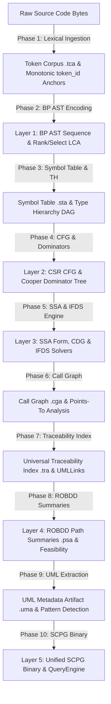
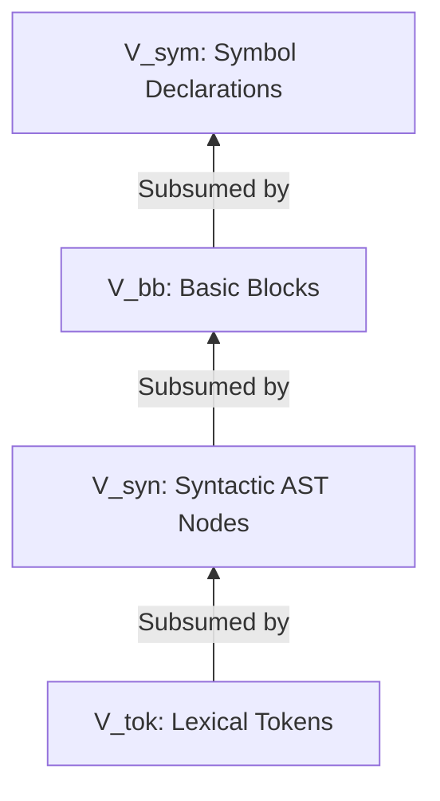
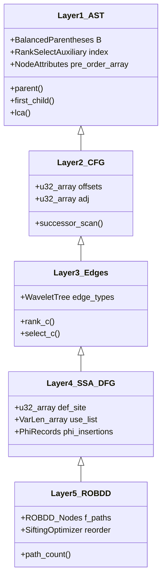
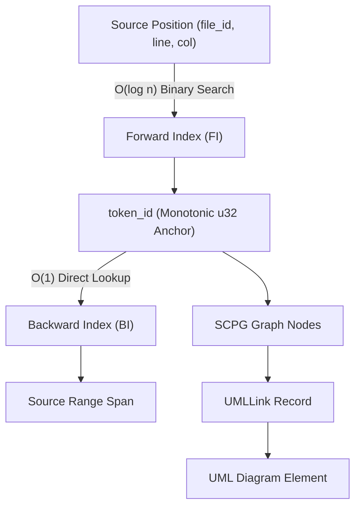
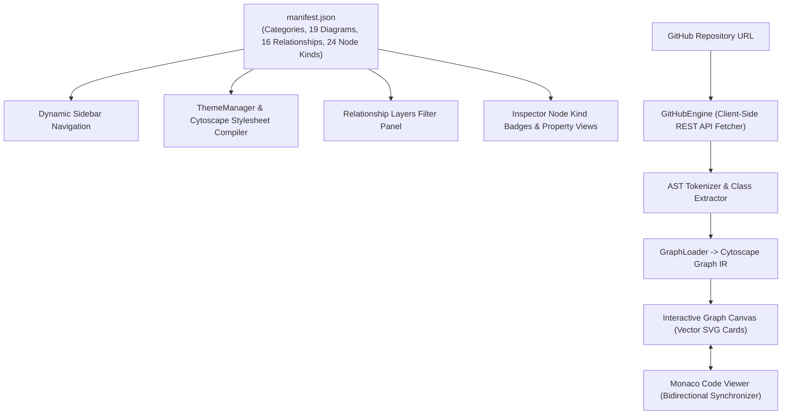

# Succinct Compositional Program Graph (SCPG) — Complete Architecture Specification

## 1. System Philosophy & Architectural Vision

The **Succinct Compositional Program Graph (SCPG)** is an advanced static program analysis graph and bidirectional UML generation engine designed, created, and maintained solely by **Ahmad Hassan (B-Ted)**.

👉 **[Launch OpenHeart Web Studio Portal (GitHub Pages)](https://ahmadhassan-bted.github.io/OpenHeart/)**

Existing static analysis frameworks (e.g., Joern Code Property Graph, LLVM IR, WALA, Eclipse EMF) suffer from severe memory inflation and pointer-chasing latency. The SCPG architecture solves these structural limitations by unifying Abstract Syntax Trees (AST), Control Flow Graphs (CFG), Data Flow Graphs (DFG), Call Graphs (CG), and Type Hierarchies (TH) into a succinct, cache-line aligned, memory-mapped graph representation.

---

## 2. Formal Mathematical Definition of SCPG

Formally, an SCPG is defined as a 7-tuple:

$$\mathcal{G} = (V, E, \nu, \varepsilon, \tau, \rho, \Sigma_\Phi)$$

### 2.1 Vertex Partition & Subsumption Lattice

The finite vertex set $V$ is partitioned into five disjoint sub-domains:

$$V = V_{\text{tok}} \sqcup V_{\text{syn}} \sqcup V_{\text{bb}} \sqcup V_{\text{ssa}} \sqcup V_{\text{sym}}$$

- $V_{\text{tok}}$: Lexical tokens scanned from source files (AST leaves).
- $V_{\text{syn}}$: Syntactic AST internal nodes.
- $V_{\text{bb}}$: Basic blocks (maximal straight-line code sequences).
- $V_{\text{ssa}}$: Variable definitions in Static Single-Assignment (SSA) form.
- $V_{\text{sym}}$: Symbol declarations (functions, classes, interfaces, fields, packages).

These vertex partitions form a strict subsumption lattice:

$$V_{\text{tok}} \subset V_{\text{syn}} \subset V_{\text{bb}} \subset V_{\text{sym}}$$

This subsumption lattice guarantees $O(1)$ bidirectional projection across graph layers without recursive graph traversals.

### 2.2 Typed Edge Alphabet ($\Sigma_E$)

The edge set $E \subseteq V \times V \times \Sigma_E$ encompasses specialized sub-graphs:

$$\Sigma_E = \{ \text{AST\_CHILD}, \text{CFG\_TRUE}, \text{CFG\_FALSE}, \text{CFG\_UNCOND}, \text{DFG\_DEF}, \text{DFG\_USE}, \text{CDG\_TRUE}, \text{CDG\_FALSE}, \text{CG\_CALL}, \text{CG\_RETURN}, \text{TH\_EXTENDS}, \text{TH\_IMPLEMENTS}, \text{TH\_USES} \}$$

---

## 3. The 5-Layer Succinct Storage Engine

### 3.1 Layer 1 — AST via Balanced Parentheses (BP)
- Encodes tree hierarchy into a parenthesis bit sequence $B \in \{(, )\}^{2n_{\text{ast}}}$.
- Equipped with Sadakane/Munro-Raman rank/select auxiliary structures supporting $O(1)$ operations: `findopen`, `findclose`, `enclose`, `parent`, `first_child`, `next_sibling`, `subtree_size`, and `LCA`.
- **Memory Compression**: 1,000,000 AST nodes require **~4.65 MB** vs. **32 MB** for traditional pointer-based trees ($6.9\times$ structure compression).

### 3.2 Layer 2 & 3 — CFG via Compressed Sparse Row (CSR) & Wavelet Trees
- Stores control flow adjacencies in packed arrays `offsets[0..n_bb]` and `adj[0..m_cfg]`.
- Edge types $\Sigma_E$ are encoded in a Wavelet Tree, enabling $O(\log \sigma)$ type-filtered edge enumeration.

### 3.3 Layer 4 — SSA Form and DFG Encoding
- Static Single-Assignment (SSA) conversion using iterated dominance frontiers ($\phi$-functions).
- Variable definitions indexed directly in $O(1)$ by variable ID; use lists stored in variable-length byte buffers.

### 3.4 Layer 5 — ROBDD Feasible Path Summaries
- Encodes feasible intraprocedural paths as a Boolean function $f_{\text{paths}}$ using Reduced Ordered Binary Decision Diagrams (ROBDDs).
- Employs Shannon expansion, complement edges, and Rudell's sifting optimization for dynamic variable reordering.
- Enables $O(|\text{ROBDD}|)$ exact path counting (#SAT) and path feasibility verification.

---

## 4. Universal Source Traceability Protocol

The traceability system relies on a monotonic 32-bit `token_id` assigned during Phase 1 lexical scanning that acts as a universal anchor across all 5 layers.

---

## 5. Complete 19-Diagram Native Derivation Matrix

| # | Diagram Name | Category | Primary SCPG Source Layer | Extractor / Serializer Module | Cytoscape Layout Engine |
|---|---|---|---|---|---|
| 01 | **Class Diagram** | UML Structural | $E^{\text{TH}}$ (Type Hierarchy) + $V_{\text{sym}}$ | `uma/structural/class_diagram.rs` | `package_tree` |
| 02 | **Package Diagram** | UML Structural | $V_{\text{sym}}$ Package Tree & Namespace Bounds | `uma/structural/package_diagram.rs` | `hierarchical` |
| 03 | **Component Diagram** | UML Structural | $V_{\text{sym}}$ Subsystem & Service Wiring | `uma/structural/component_diagram.rs` | `hierarchical` |
| 04 | **Composite Structure** | UML Structural | Internal Field Symbols & Port Connectors | `uma/structural/composite_diagram.rs` | `hierarchical` |
| 05 | **Object Diagram** | UML Structural | $E^{\text{TH}}$ + SSA Heap Instance Links | `uma/structural/object_diagram.rs` | `hierarchical` |
| 06 | **Deployment Diagram** | UML Structural | Node Artifacts & Hardware Execution Targets | `scpg/diagram/export/json.rs` | `hierarchical` |
| 07 | **Profile Diagram** | UML Structural | Metamodel Stereotypes & Tagged Values | `scpg/diagram/export/json.rs` | `hierarchical` |
| 08 | **Sequence Diagram** | UML Behavioral | $E^{\text{CG}}$ (Call Graph) + Lifeline Traces | `uma/behavioral/sequence_diagram.rs` | `sequence` |
| 09 | **State Machine Diagram** | UML Behavioral | $E^{\text{CFG}}$ + State Transition Traversal | `uma/behavioral/state_machine.rs` | `hierarchical` |
| 10 | **Activity Diagram** | UML Behavioral | $E^{\text{CFG}}$ + CDG Dominance Branches | `uma/behavioral/activity_diagram.rs` | `hierarchical` |
| 11 | **Use Case Diagram** | UML Behavioral | Public API Surface Boundaries & Actors | `uma/actor_identification.rs` | `usecase` |
| 12 | **Communication Diagram** | UML Behavioral | $E^{\text{CG}}$ Topology + Sequenced Numbers | `uma/behavioral/communication_diagram.rs` | `hierarchical` |
| 13 | **Interaction Overview** | UML Behavioral | Nested Sequence Reference Frames (`ref sd`)| `uma/behavioral/interaction_overview.rs` | `hierarchical` |
| 14 | **Timing Diagram** | UML Behavioral | Multi-Track Waveforms & Temporal Bounds | `uma/behavioral/timing_diagram.rs` | `timing` |
| 15 | **Control Flow Graph (CFG)** | Compiler IR | $V_{\text{bb}}$ Basic Blocks + CSR Adjacency | `scpg/diagram/export/json.rs` | `hierarchical` |
| 16 | **Data Flow Graph (DFG)** | Compiler IR | SSA Def-Use Chains & Lineage Vectors | `scpg/diagram/export/json.rs` | `hierarchical` |
| 17 | **Control Dependence (CDG)** | Compiler IR | Reversed Post-Dominance Frontiers | `scpg/diagram/export/json.rs` | `hierarchical` |
| 18 | **Call Graph (CG)** | Compiler IR | Interprocedural Call Sites & CHA Dispatch | `scpg/diagram/export/json.rs` | `hierarchical` |
| 19 | **ROBDD Saturation** | Compiler IR | Canonical BDD Graphs & #SAT Path Counts | `scpg/diagram/export/json.rs` | `hierarchical` |

---

## 6. Declarative Manifest & Zero-Backend Web Studio Architecture

The OpenHeart Web Studio is built on a 100% serverless, zero-backend architecture hosted on GitHub Pages:

- **Manifest-Driven Configuration**: Centralized `web/diagrams/manifest.json` defines all terminology, badge colors, layout algorithms, and relationship semantics without hardcoding.
- **Dynamic Cytoscape Stylesheet Compiler**: `ThemeManager` compiles Cytoscape edge styles and arrowheads dynamically based on the active theme (Obsidian Dark or Swiss Light).
- **In-Browser GitHub Engine**: Analyzes public GitHub repositories dynamically on GitHub Pages with zero server dependencies and automatic rate-limit fallback.
