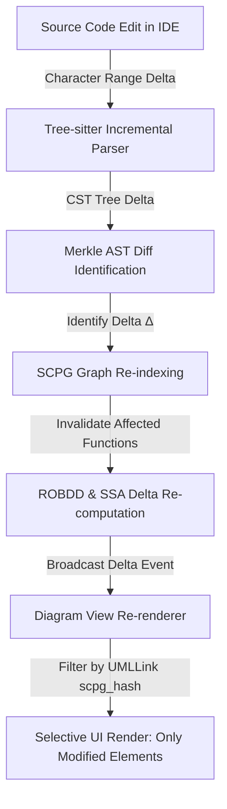

# Universal Traceability & Incremental Synchronization Protocol

This document specifies the bidirectional traceability mechanism and incremental diff synchronization engine of the **Succinct Compositional Program Graph (SCPG)**.

---

## 1. Monotonic `token_id` Traceability Anchor

Every lexical token generated during Phase 1 scanner ingestion is assigned a unique, monotonically increasing 32-bit identifier:

$$\text{token\_id} \in \mathbb{N}, \quad 0 \le \text{token\_id} < n_{\text{tok}}$$

This `token_id` is the **universal traceability anchor**. It propagates upward through all subsequent layers without re-assignment or re-interpretation.

```mermaid
graph TD
    Scanner["Lexical Scanner (Phase 1)"] -->|Assigns Monotonic token_id: u32| AST["AST Leaves & Nodes (Phase 2)"]
    AST -->|Ranges [min_token_id, max_token_id]| BB["Basic Blocks & Statements (Phase 3)"]
    BB -->|Statement AST Spans| SSA["SSA Def-Use Sites (Phase 3/4)"]
    SSA -->|Definition & Operand Reference| UML["UML Diagram Elements (Phase 5)"]
    UML -->|Embeds UMLLink Record| Anchor["Bijective Source Range Span"]
```

---

## 2. Forward and Backward Traceability Indices

### 2.1 Forward Index (Source Position $\to$ Token ID)
- **Packed Key ($u48$ packed into $u64$)**:
  $$\text{key} = (\text{file\_id} \ll 48) \mid (\text{line} \ll 24) \mid (\text{col} \ll 8)$$
- **Forward Array (`FI`)**: Sorted array of `(key, token_id)` pairs.
- **Lookup Complexity**: Point query via `lower_bound` binary search in $O(\log n_{\text{tok}})$. Range query for source range $[l_{\text{start}}..l_{\text{end}}]$ in $O(\log n_{\text{tok}} + k)$ returning $k$ enclosed tokens.

### 2.2 Backward Index (Token ID $\to$ Source Position)
- **Backward Array (`BI`)**: Dense array indexed directly by `token_id`.
- **Entry Structure (10 bytes)**: `(file_id: u16, line: u24, col: u16, len: u16)`.
- **Lookup Complexity**: Direct array dereference `BI[token_id]` in **$O(1)$ time**. Zero hash computation, zero pointer chasing.

---

## 3. Incremental Synchronization Engine



### 3.1 `UMLLink` Record Layout

Every generated UML diagram element stores an immutable `UMLLink` record:

```rust
#[repr(C)]
pub struct UMLLink {
    pub node_id: u32,
    pub node_type: u8,
    pub file_id: u16,
    pub line_start: u32,  // 24-bit
    pub col_start: u16,
    pub line_end: u32,    // 24-bit
    pub col_end: u16,
    pub scpg_hash: u32,   // 32-bit hash of SCPG state at generation time
}
```

### 3.2 5-Stage Incremental Diff Protocol

1. **Rope Buffer Maintenance**: Source text maintained as a balanced BST over string fragments supporting $O(\log n)$ inserts and deletes.
2. **Incremental CST Parsing**: Tree-sitter re-parses only the affected region in $O(|\text{affected\_region}| + |\text{changed\_nodes}|)$ time.
3. **Merkle AST Diffing**: Identifies precise delta set $\Delta = (\Delta_{\text{added}}, \Delta_{\text{removed}}, \Delta_{\text{modified}})$.
4. **SCPG Graph Delta Application**:
   - Excise removed nodes from BP AST sequence and traceability arrays.
   - Insert new nodes at correct pre-order pre-position.
   - Recompute CFG, SSA, and ROBDD summaries **only for affected functions**.
5. **Selective Diagram View Refresh**: Hash comparison between `UMLLink.scpg_hash` and current SCPG hash detects stale diagram elements in $O(1)$ time. Re-renders only diagram elements whose underlying source nodes intersect $\Delta$.

> **Example**: Modifying a private method body recomputes ROBDDs for that single method. Class box geometry, package structures, and unaffected sequence diagrams remain untouched.
