# SCPG Universal Diagram Suite — Formal Derivation Specification (19 Projections)

This document defines the formal mappings, query formulas, and derivation algorithms for generating all **14 standard OMG UML 2.5 diagram types** and **5 deep compiler pipeline IRs** directly from the **Succinct Compositional Program Graph (SCPG)**.

---

## 1. Classification & Sub-Graph Mapping Matrix

```mermaid
graph TD
    SCPG["Succinct Compositional Program Graph (SCPG)"] --> Structural["1. UML Structural (7)"]
    SCPG --> Behavioral["2. UML Behavioral (7)"]
    SCPG --> CompilerIR["3. Compiler Pipeline IRs (5)"]

    subgraph Structural_Views["UML 2.5 Structural Projections"]
        Structural --> D1["01 · Class Diagram (E^TH + V_sym)"]
        Structural --> D2["02 · Package Diagram (V_sym Namespaces)"]
        Structural --> D3["03 · Component Diagram (V_sym Modules)"]
        Structural --> D4["04 · Composite Structure (Parts & Ports)"]
        Structural --> D5["05 · Object Diagram (E^TH + SSA Instances)"]
        Structural --> D6["06 · Deployment Diagram (V_sym + Artifacts)"]
        Structural --> D7["07 · Profile Diagram (Stereotype Records)"]
    end

    subgraph Behavioral_Views["UML 2.5 Behavioral Projections"]
        Behavioral --> D8["08 · Sequence Diagram (E^CG + ROBDD Paths)"]
        Behavioral --> D9["09 · State Machine (E^CFG + State Invariants)"]
        Behavioral --> D10["10 · Activity Diagram (E^CFG + CDG Branches)"]
        Behavioral --> D11["11 · Use Case Diagram (API Surface + Actors)"]
        Behavioral --> D12["12 · Communication Diagram (E^CG + Ordinals)"]
        Behavioral --> D13["13 · Interaction Overview (CFG + Ref Frames)"]
        Behavioral --> D14["14 · Timing Diagram (Waveforms + Time Bounds)"]
    end

    subgraph Compiler_Views["Compiler Pipeline IR Projections"]
        CompilerIR --> D15["15 · Control Flow Graph (V_bb + CSR CFG)"]
        CompilerIR --> D16["16 · Data Flow Graph (SSA Def-Use Lineage)"]
        CompilerIR --> D17["17 · Control Dependence (Reversed Post-DOM)"]
        CompilerIR --> D18["18 · Call Graph (CHA Virtual Dispatch)"]
        CompilerIR --> D19["19 · ROBDD Saturation (Exact #SAT Counts)"]
    end
```

---

## 2. Structural Diagrams Derivation Rules

### 2.1 Class Diagram (01)
- **Vertices**: $v \in V_{\text{sym}}$ where $\text{kind}(v) \in \{ \text{CLASS}, \text{INTERFACE}, \text{ENUM}, \text{RECORD}, \text{TRAIT}, \text{STRUCT} \}$.
- **Attributes & Operations**: Extracted from child nodes of $v$ in $V_{\text{sym}}$ with normalized visibility modifiers (`+`, `-`, `#`, `~`).
- **Edges**:
  - Generalization (`--|>`): $(u, v) \in E^{\text{TH}}$ with label `TH_EXTENDS`.
  - Realization (`..|>`): $(u, v) \in E^{\text{TH}}$ with label `TH_IMPLEMENTS`.
  - Association (`-->`): Fields in class $u$ referencing classifier $v$.
  - Aggregation (`o--`): Collection fields in class $u$ containing classifier $v$.
  - Composition (`*--`): Final/owned fields in class $u$ holding classifier $v$.

### 2.2 Package Diagram (02)
- **Vertices**: Package namespace nodes $v \in V_{\text{sym}}$ where $\text{kind}(v) = \text{PACKAGE}$.
- **Edges**: Inter-package dependencies $(u, v)$ where types in package $u$ reference types in package $v$.

### 2.3 Component Diagram (03)
- **Vertices**: Modular architectural subsystems and components.
- **Interfaces**: Provided socket interfaces (`()`) and required dependencies.

### 2.4 Composite Structure Diagram (04)
- **Vertices**: Classifiers with internal structured parts and port pins (`port_in`, `port_out`).
- **Edges**: Assembly connectors (`-(0-`) wiring collaborating internal parts.

### 2.5 Object Diagram (05)
- **Vertices**: Concrete instances evaluated from SSA variable definitions $V_{\text{ssa}}$ and heap allocation sites.
- **Slot Values**: Field value assignments bound to object instances at runtime execution points.

### 2.6 Deployment Diagram (06)
- **Vertices**: Execution environments, hardware devices, and distribution artifacts (`.jar`, `.so`, `.wasm`).
- **Edges**: Manifestation (`..>`) and communication deployment links.

### 2.7 Profile Diagram (07)
- **Vertices**: Metamodels, stereotypes (`<<stereotype>>`), and tagged value attributes.
- **Edges**: Extension (`--|>`) extending standard UML metaclasses.

---

## 3. Behavioral & Interaction Diagrams Derivation Rules

### 3.1 Sequence Diagram (08)
- **Lifelines**: Class and instance symbols participating in the scenario call sequence.
- **Messages**: Interprocedural call edges $(u, v) \in E^{\text{CG}}$ labeled `CG_CALL` and return responses `CG_RETURN`.
- **Combined Fragments (alt, loop, opt)**: Feasible paths derived from intraprocedural ROBDD path summaries $\Sigma_\Phi$.

### 3.2 State Machine Diagram (09)
- **States**: Reachable states computed over domain variables with entry, do, and exit activity rows.
- **Transitions**: Method invocations modifying state variables with guard conditions `[guard]`.

### 3.3 Activity Diagram (10)
- **Action Nodes**: Basic block statement nodes $v \in V_{\text{bb}}$.
- **Control Flow Edges**: $E^{\text{CFG}}$ edges labeled `CFG_TRUE`, `CFG_FALSE`, `CFG_UNCOND`.
- **Decision & Merge Nodes**: Derived from dominance frontiers $DF(v)$ and branch splits.

### 3.4 Use Case Diagram (11)
- **Actors**: External client entities derived from public entrypoints and API boundaries.
- **Use Cases**: Public service methods enclosed in system boundary boxes.
- **Relationships**: Association, `<<include>>`, and `<<extend>>` dependencies.

### 3.5 Communication Diagram (12)
- **Collaborating Objects**: Instance nodes interacting within a scenario.
- **Sequenced Messages**: Collaboration links annotated with sequenced invocation order numbers (`1: init()`, `2: process()`).

### 3.6 Interaction Overview Diagram (13)
- **Frames**: High-level control flow graph containing nested sequence reference frames (`ref sd`).

### 3.7 Timing Diagram (14)
- **Tracks**: Multi-track lifelines showing temporal state changes over discrete clock events (`@0ms`, `@50ms`, `@150ms`).

---

## 4. Compiler Pipeline IR Projections Derivation Rules

### 4.1 Control Flow Graph - CFG (15)
- **Basic Blocks**: Maximal straight-line instruction sequences with single entry and exit.
- **Edges**: Unconditional jumps, conditional true/false branches, and loop back-edges.

### 4.2 Data Flow Graph - DFG (16)
- **Data Nodes**: SSA variable definition versions ($v_0, v_1, \dots$).
- **Value Lineage Edges**: Direct def-use chains linking definitions to consumption points.

### 4.3 Control Dependence Graph - CDG (17)
- **Control Conditions**: Control dependencies derived by inverting post-dominator frontiers over the CFG.

### 4.4 Call Graph - CG (18)
- **Functions**: Procedure declaration nodes across the whole program.
- **Invocations**: Static call sites and polymorphic virtual dispatch resolved via Class Hierarchy Analysis (CHA).

### 4.5 ROBDD Saturation Graph (19)
- **Decision Gates**: Canonical Shannon expansion decision variables ($x_1, x_2, \dots$).
- **Terminals**: Constant $0$ (UNSAT / FALSE) and $1$ (SAT / TRUE) sinks with exact #SAT feasible path metrics.

---

## 5. Query Formulas for Diagram Derivation

### 5.1 Class Hierarchy Query
To extract the complete type hierarchy for class $C$:

$$\text{Hierarchy}(C) = \{ v \in V_{\text{sym}} \mid (C, v) \in (E^{\text{TH}})^* \}$$

Evaluated using transitive closure over $E^{\text{TH}}$ in $O(|V_{\text{sym}}| + |E^{\text{TH}}|)$ time.

### 5.2 Feasible Interprocedural Call Sequence Query
To extract all call sequences between method $M_{\text{start}}$ and method $M_{\text{target}}$:

$$\text{Path}(M_{\text{start}}, M_{\text{target}}) = \{ \pi \in (E^{\text{CG}})^* \mid \text{first}(\pi) = M_{\text{start}} \land \text{last}(\pi) = M_{\text{target}} \land \text{feasible}(\pi, \Sigma_\Phi) \}$$

Evaluated via CFL-reachability over the exploded supergraph $G^\#$.
