# SCPG to 14 UML Diagrams Native Derivation Specification

This document defines the formal mappings, query formulas, and derivation algorithms for generating all 14 standard UML 2.5 diagram types directly from the **Succinct Compositional Program Graph (SCPG)**.

---

## 1. Classification & Sub-Graph Mapping Matrix

```mermaid
graph TD
    SCPG["Succinct Compositional Program Graph (SCPG)"] --> Structural["Structural Diagrams (7)"]
    SCPG --> Behavioral["Behavioral & Interaction Diagrams (7)"]

    subgraph Structural_Views["Structural Diagrams"]
        Structural --> D1["1. Class Diagram (E^TH + V_sym)"]
        Structural --> D2["2. Object Diagram (E^TH + SSA Instances)"]
        Structural --> D3["3. Component Diagram (V_sym Modules)"]
        Structural --> D4["4. Deployment Diagram (V_sym + Artifacts)"]
        Structural --> D5["5. Package Diagram (V_sym Namespaces)"]
        Structural --> D6["6. Composite Structure (Fields & Ports)"]
        Structural --> D7["7. Profile Diagram (Stereotype Records)"]
    end

    subgraph Behavioral_Views["Behavioral & Interaction Diagrams"]
        Behavioral --> D8["8. Use Case Diagram (API Surface + Actor)"]
        Behavioral --> D9["9. Activity Diagram (E^CFG + CDG)"]
        Behavioral --> D10["10. State Machine (E^CFG + AbsInt Lattices)"]
        Behavioral --> D11["11. Sequence Diagram (E^CG + ROBDD Paths)"]
        Behavioral --> D12["12. Communication Diagram (E^CG + Order)"]
        Behavioral --> D13["13. Interaction Overview (CFG + Calls)"]
        Behavioral --> D14["14. Timing Diagram (State + Time Bounds)"]
    end
```

---

## 2. Structural Diagrams Derivation Rules

### 2.1 Class Diagram ([1])
- **Vertices**: $v \in V_{\text{sym}}$ where $\text{kind}(v) \in \{ \text{CLASS}, \text{INTERFACE}, \text{ENUM}, \text{RECORD} \}$.
- **Attributes & Operations**: Extracted from child nodes of $v$ in $V_{\text{sym}}$ with visibility modifiers (`PUBLIC`, `PRIVATE`, `PROTECTED`, `PACKAGE`).
- **Edges**:
  - Generalization: $(u, v) \in E^{\text{TH}}$ with label `TH_EXTENDS`.
  - Realization: $(u, v) \in E^{\text{TH}}$ with label `TH_IMPLEMENTS`.
  - Association / Aggregation: Fields in class $u$ whose type is class $v$.

### 2.2 Object Diagram ([2])
- **Vertices**: Concrete instances evaluated from SSA variable definitions $V_{\text{ssa}}$ and heap allocation sites.
- **Slot Values**: Value assignments bound to field symbols at runtime execution points.

### 2.3 Component Diagram ([3])
- **Vertices**: Top-level packages, modules, or JAR/crate artifacts in $V_{\text{sym}}$.
- **Interfaces**: Provided and required interface bindings resolved via $E^{\text{TH}}$ implementation edges.

### 2.4 Package Diagram ([5])
- **Vertices**: Package/namespace nodes $v \in V_{\text{sym}}$ where $\text{kind}(v) = \text{PACKAGE}$.
- **Edges**: Package import dependencies $(u, v)$ where a class in package $u$ references a symbol in package $v$.

---

## 3. Behavioral & Interaction Diagrams Derivation Rules

### 3.1 Sequence Diagram ([11])
- **Lifelines**: Class and instance symbols participating in the call sequence.
- **Messages**: Interprocedural call edges $(u, v) \in E^{\text{CG}}$ labeled `CG_CALL` and return edges `CG_RETURN`.
- **Combined Fragments (alt, loop, opt)**: Feasible paths derived from intraprocedural ROBDD path summaries $\Sigma_\Phi$.
  - `alt` fragment: Binary branch nodes in ROBDD with mutually exclusive conditions.
  - `loop` fragment: Cyclic edges in control flow graph $E^{\text{CFG}}$.

### 3.2 Activity Diagram ([9])
- **Action Nodes**: Basic block statement nodes $v \in V_{\text{bb}}$.
- **Control Flow Edges**: $E^{\text{CFG}}$ edges labeled `CFG_TRUE`, `CFG_FALSE`, `CFG_UNCOND`.
- **Decision & Merge Nodes**: Derived from dominance frontiers $DF(v)$ and basic block entry/exit split points.

### 3.3 State Machine Diagram ([10])
- **States**: Reachable abstract states computed via Abstract Interpretation over class state variables using Interval/Octagon domains.
- **Transitions**: Method invocations modifying state variable values, with transition guards derived from method preconditions in ROBDD path summaries.

---

## 4. Query Formulas for Diagram Derivation

### 4.1 Class Hierarchy Query
To extract the complete type hierarchy for class $C$:

$$\text{Hierarchy}(C) = \{ v \in V_{\text{sym}} \mid (C, v) \in (E^{\text{TH}})^* \}$$

Evaluated using transitive closure over $E^{\text{TH}}$ in $O(|V_{\text{sym}}| + |E^{\text{TH}}|)$ time.

### 4.2 Feasible Interprocedural Call Sequence Query
To extract all call sequences between method $M_{\text{start}}$ and method $M_{\text{target}}$:

$$\text{Path}(M_{\text{start}}, M_{\text{target}}) = \{ \pi \in (E^{\text{CG}})^* \mid \text{first}(\pi) = M_{\text{start}} \land \text{last}(\pi) = M_{\text{target}} \land \text{feasible}(\pi, \Sigma_\Phi) \}$$

Evaluated via CFL-reachability over the exploded supergraph $G^\#$.
